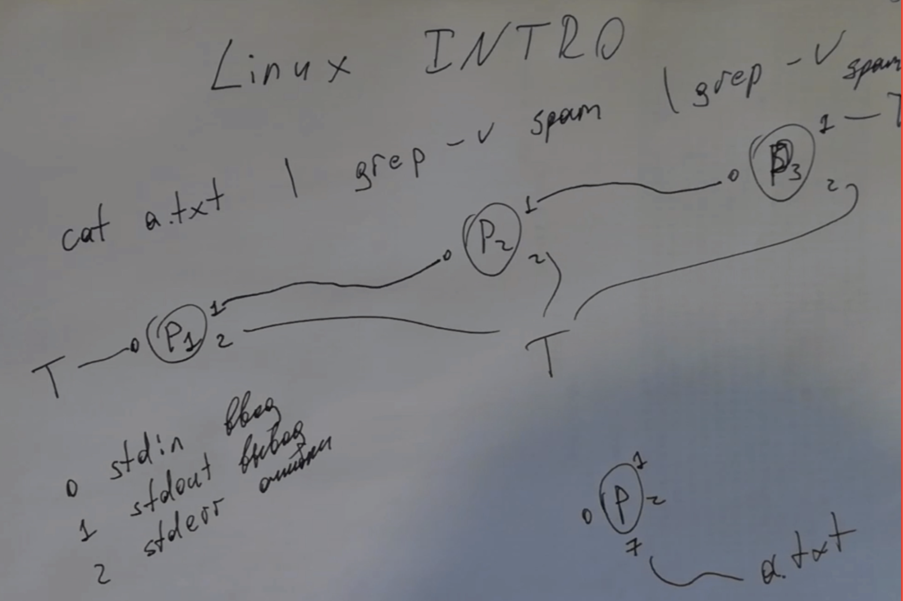

# Вступление: Linux, командная строка, Jupyter notebook

Возможно кому-то Jupyter notebook покажется лишним в этом ряду, но так случилось, что я буду вести у вас АКОС, а мне он кажется очень удобным инструментом :) И вы в будущем все равно с ним столкнетесь на других курсах.

<table width=100%> <tr>
    <th width=20%> <b>Видеозапись семинара &rarr; </b> </th>
    <th>
    <a href="https://youtu.be/E0lg8pzzR7o">
         
    </a>
    </th>
    <th> </th>
 </table>


[Ридинг Яковлева](https://github.com/victor-yacovlev/mipt-diht-caos/blob/master/practice/linux_basics/intro.md) **И сейчас, и в будущем: читайте эти ридинги, там много полезной информации. Я стараюсь ее не дублировать, использование моих ноутбуков подразумевает чтение ридингов Яковлева.**


Сегодня в программе:
* <a href="https://github.com/victor-yacovlev/mipt-diht-caos/blob/master/practice/linux_basics/intro.md" style="color:#856024"> Очень кратко о Linux </a>
* <a href="#terminal" style="color:#856024"> Часто используемые команды терминала </a>
  * <a href="#task1" style="color:#856024"> Задача 1 </a>
  * <a href="#task2" style="color:#856024"> Задача 2 </a>
  * <a href="#task3" style="color:#856024"> Задача 3 </a>
* <a href="#jupyter" style="color:#856024"> Особенности Jupyter notebok используемые в курсе </a>


## <a name="linux"></a> Очень кратко о Linux

Читайте [ридинг Яковлева](https://github.com/victor-yacovlev/mipt-diht-caos/blob/master/practice/linux_basics/intro.md). Там неплохо написано про линукс и не только.

Еще есть [конспект семинара Александра Пономарева](https://github.com/Alexponomarev7/caos_seminars/tree/master/sem1).

И куча статей в интернете :)

Если вы все это знаете, можете поиграть в [bandit](https://overthewire.org/wargames/bandit/). Сложненько, но интересно

## <a name="terminal"></a> Часто используемые команды терминала

Первая важная особенность Jupyter notebook: можно запускать консольные команды, добавляя `!` в начало.
То есть `!echo Hello` запустит `echo Hello` примерно так же, как это происходило бы в консоли.

### `cd`, `pwd`, `cp`, `mv`

`cd` - команда оболочки `bash`

`export PWD=/home` - альтернатива `cd`

Почти все остальные часто используемые команды - на самом деле запускаемые программы.


### `echo`


```python
# Вывод строки
!echo Hello
```

    Hello


### `>`, `>>`, `cat`


```python
# Перенаправление вывода в файл
!echo "Hello1" > file.txt
!echo "Hello2" > file.txt # Файл перезапишется
# Перенаправление вывода в файл (при этом файл дозапишется, а не перезапишется)
!echo "Hello3" >> file.txt

# Вывод файла 
!cat file.txt
```

    Hello2
    Hello3


```python
! >file.txt echo "Hello1" # И так тоже можно :)
!cat file.txt
```

    Hello1


Еще особенность Jupyter notebook: можно делать ячейки "магическими", добавляя `%%bash`, `%%python`, `%%time` в начало.

Магия `%%bash` запустит ячейку как bash-скрипт. А bash-скрипт это почти то же самое, что последовательность команд в консоли.


```bash
%%bash 
exec 2>&1 # Настройка bash, чтобы все что пишется в поток ошибок на самом деле писалось в стандартный поток
set -x # Настройка bash, чтобы он выводил все исполняемые команды в поток ошибок

# -e включает восприятие \n как перевода строки у команды echo
echo -e "Hello1\nHello2" > file.txt
cat file.txt
```

    + echo -e 'Hello1\nHello2'
    + cat file.txt
    Hello1
    Hello2


### `|`, `<`


```bash
%%bash 
exec 2>&1 ; set -x # Команды можно писать в одну строчку разделяя с помощью ;

echo -e "Hello1\nHello2\nHello10" > file.txt
# Можно направлять вывод одной команды на вход другой с помощью |
# Команда grep в таком использовании читает все строки из входа, 
#   и выводит только содержащие подстроку`o1`
cat file.txt | grep o1

<file.txt grep llo2
grep llo2 < file.txt
```

    + echo -e 'Hello1\nHello2\nHello10'
    + cat file.txt
    + grep o1
    Hello1
    Hello10
    + grep llo2
    Hello2
    + grep llo2
    Hello2


```bash
%%bash 
# Можно объединять команды с помощью &&
# Тогда вторая выполнится только, если успешно выполнилась первая (как и в C/C++)
echo -n "Hello " && echo world!
echo -----------------
echo -n "Hello " || echo world! ; echo
echo -----------------
echo -n "Hello " && echBUG1o -n jail && echo -n freedom! ; echo
echo -----------------
echo -n "Hello " && echBUG1o jail || echo freedom!
```

    Hello world!
    -----------------
    Hello 
    -----------------
    Hello 
    -----------------
    Hello freedom!


    bash: line 7: echBUG1o: command not found
    bash: line 9: echBUG1o: command not found


```bash
%%bash 
exec 2>&1 ; set -x
# Создадим пустой файл
touch a.txt
# Выведем список файлов в папке
ls *.txt
# Удалим файл
rm a.txt && echo "rm success" || echo "rm fail"
rm a.txt && echo "rm success" || echo "rm fail"
```

    + touch a.txt
    + ls a.txt b.txt file2.txt file.txt
    a.txt
    b.txt
    file2.txt
    file.txt
    + rm a.txt
    + echo 'rm success'
    rm success
    + rm a.txt
    rm: cannot remove 'a.txt': No such file or directory
    + echo 'rm fail'
    rm fail


```bash
%%bash 
exec 2>&1 ; set -x
# Начало, конец файла, количество строк
echo -e "1\n2\n3\n4" > a.txt
cat a.txt | head -n 2
cat a.txt | tail -n 2
cat a.txt | wc -l
```

    + echo -e '1\n2\n3\n4'
    + cat a.txt
    + head -n 2
    1
    2
    + cat a.txt
    + tail -n 2
    3
    4
    + cat a.txt
    + wc -l
    4


```python
# Получить документацию по программе легко с помощью команды man
!man head | head -n 10
```

А, важный момент, вообще по умолчанию в ячейках Jupyter notebook пишется код на том языке, с ядром которого запущен ноутбук. Сейчас это python3


```python
with open("b.txt", "w") as f:
    for i in range(100):
        tup = (str(i), "div17" if i % 17 == 0 else "no17")
        f.write("\t".join(tup) + "\n")
```

## <a name="task1"></a> Задача 1


```bash
%%bash
cat b.txt | head -n 5
# Выведите все строчки где есть подстрока div17
# <your line of code here>
```

    0	div17
    1	no17
    2	no17
    3	no17
    4	no17


## <a name="task2"></a> Задача 2


```bash
%%bash
# Выясните, что выведет следующая команда, не запуская ее.
# echo -e "A\nB\nC\nD" | grep -v C -n 
# Используйте только команды man и grep
```


```bash
%%bash
# Подсказка
man grep | grep -e "-C" -C 2
```

                  option, this has no effect and a warning is given.
    
           -C NUM, -NUM, --context=NUM
                  Print NUM lines of output context.  Places a line  containing  a
                  group separator (--) between contiguous groups of matches.  With


## <a name="task3"></a> Задача 3


```bash
%%bash

# Создадим файл на 100 строк
( for i in {0..99} ; do echo line$i ; done ) > a.txt
cat a.txt | head -n 3

# А теперь напишите последовательность команд, которая заменит вторую строчку с line1 на line100
# нельзя использовать replace конструкции, вам достаточно команд, которые были перечислены ранее :)

# <your code here>
```

    line0
    line1
    line2


<details> <summary> Способ в лоб (пожалуйста не смотрите, пока не напишете код решения задачки) </summary>
  <pre> <code> cat a.txt | python2 -c 'import sys; lines = list(sys.stdin); lines[1] = "line100\n"; print "".join(lines)' </code> </pre>
</details>


```python

```

### Стандартные потоки ввода (stdin, 0), вывода (stdout, 1), ошибок (stderr, 2)

По умолчанию, когда мы запускаем программу, то у нее есть три стандартных потока: 
* ввода (через него все что мы печатаем в терминале передается программе) 
* вывода (через него то, что выводит программа (printf, std::cout) попадает в терминал)
* ошибок (примерно то же, что и stdout, но по-другому исползуется)


```bash
%%bash
echo Hello # Успешное завершение в вывод текста в stdout
rm not_existent_file # Ошибка, и текст пишется в поток stderr
true # Просто успешно завершающаяся команда, чтобы скрипт не завершился ошибкой.
```

    Hello


    rm: cannot remove 'not_existent_file': No such file or directory


Потоки ввода можно перенаправлять в файлы:


```bash
%%bash
echo Hello 1> out.txt 2> err.txt 
echo "stdout: \"`cat out.txt`\" stderr: \"`cat err.txt`\"" 
rm not_existent_file 1> out.txt 2> err.txt 
echo "stdout: \"`cat out.txt`\" stderr: \"`cat err.txt`\""

echo "Hello stXdents!" > file.txt
python2 -c "import sys; print list(sys.stdin)[0].replace('stXdents', 'students')" 0< file.txt
python2 -c "import os; print os.read(10, 100)" 10< file.txt # подумайте, что бы это могло быть :)
```

    stdout: "Hello" stderr: ""
    stdout: "" stderr: "rm: cannot remove 'not_existent_file': No such file or directory"
    Hello students!
    
    Hello stXdents!
    


При этом `>` синоним к `>1` (аналогично `>>`). А `0<` то же самое что и `<`.


```python

```

### `ps`, `top`, `kill`, `killall`, `pidof` - найти, убить, убить попроще, найти по имени


```bash
%%bash
ps aux | grep ipyk
```

    pechatn+   83544  0.0  2.4 552820 50372 ?        Ssl  06:42   0:06 /usr/bin/python3 -m ipykernel_launcher -f /home/pechatnov/.local/share/jupyter/runtime/kernel-b516c8c2-9d61-4427-b1e7-4093e713084b.json
    pechatn+   83634  0.0  2.3 550660 47524 ?        Ssl  06:49   0:02 /usr/bin/python3 -m ipykernel_launcher -f /home/pechatnov/.local/share/jupyter/runtime/kernel-ef4f098b-5748-4e02-b2dc-8b169c68baca.json
    pechatn+   89374  0.1  2.3 551588 48756 ?        Ssl  14:07   0:03 /usr/bin/python3 -m ipykernel_launcher -f /home/pechatnov/.local/share/jupyter/runtime/kernel-b9d9533d-f121-4a84-af61-4a855dd1c410.json
    pechatn+   89824  0.0  0.0  17668   732 ?        S    14:58   0:00 grep ipyk


```cpp
%%cpp bad_program.cpp
%run g++ -O3 -Os bad_program.cpp -o bad_program.exe
int main() { while (1) {} }
```


Run: `g++ -O3 -Os bad_program.cpp -o bad_program.exe`


`TInteractiveLauncher` - моя магическая штука для запуска программ в интерактивном режиме из Jupyter notebook


```python
a = TInteractiveLauncher("./bad_program.exe")
```


<pre>
L | Process started. PID = 90909

</pre>


```python
get_ipython().system("ps aux | grep bad_prog")
```

    pechatn+   89956  0.3  0.5  28624 11568 ?        S    15:10   0:01 python3 ../tools/launcher.py -l ./interactive_launcher_tmp/38653968711948138.log -i ./interactive_launcher_tmp/38653968711948138.inq -c ./bad_program.exe
    pechatn+   89957 99.8  0.0   2356   516 ?        R    15:10   7:43 ./bad_program.exe
    pechatn+   90003  0.0  0.0   2608   600 pts/2    Ss+  15:17   0:00 /usr/bin/sh -c ps aux | grep bad_prog
    pechatn+   90005  0.0  0.0  17668   664 pts/2    S+   15:17   0:00 grep bad_prog


```python
get_ipython().system("kill -9 " + str(a.get_pid()))
a.close()
```


```python
a = TInteractiveLauncher("./bad_program.exe")
get_ipython().system("pidof bad_program.exe")
get_ipython().system("killall -9 bad_program.exe")
a.close()
```


<pre>
L | Process started. PID = 83766
L | Process finished. Got signal 9

</pre>


    83766


```python

```


```python

```


```python

```


```python

```

## <a name="jupyter"></a> Особенности Jupyter notebok используемые в курсе


```python
# код на питоне
[i for i in range(0, 3000, 17) if str(i).endswith("19")] # просто что-то странное
```


    [119, 1819]


```bash
%%bash
echo "Bash code"
```

    Bash code


Jupyter notebook позволяет определять собственную магию. И в первой ячейке каждого моего ноутбука есть однострочник, который определяет несколько магий:


```python
# Просто вывод строки и ее значения как выражения в питоне
a = 1; b = 2
%p a + b # Sum of a and b
%p (a, b)
```


`a + b = 3`  # Sum of a and b


(a, b) = (1, 2)


```python
%%save_file file.txt 
%# Сохраняет ячейку как файл, комментируя загаловок (А в этой строке просто комментарий)
%run cat file.txt # Выполняет команды следующие после %run в заголовках ячейки
Содержимое файла
```


Run: `cat file.txt # Выполняет команды следующие после %run в заголовках ячейки`


    # %%cpp file.txt 
    # %# Сохраняет ячейку как файл
    # %run cat file.txt # Выполняет команды следующие после %run в заголовках ячейки
    Содержимое файла
    


```python
%%save_file a.sh
%run bash a.sh

echo 123
```


Run: `bash a.sh`


    123


```cpp
%%cpp a.cpp
%# По большому счету тот же save_file, но подсвечивает синтаксис C++
%run g++ a.cpp -o a.exe
%run ./a.exe

#include <iostream>

int main() {
    std::cout << "Hello world!" << std::endl;
}
```


Run: `g++ a.cpp -o a.exe`


Run: `./a.exe`


    Hello world!


```python
!cat a.cpp
```

    // %%cpp a.cpp
    // %# По большому счету тот же save_file, но подсвечивает синтаксис C++
    // %run g++ a.cpp -o a.exe
    // %run ./a.exe
    
    #include <iostream>
    
    int main() {
        std::cout << "Hello world!" << std::endl;
    }
    


```python

```


```cpp
%%cpp b.cpp
%run g++ b.cpp -o b.exe

#include <iostream>

int main() {
    std::string s;
    std::cin >> s;
    std::cout << "STDOUT " << s << std::endl;
    std::cerr << "STDERR " << s << std::endl;
}
```


Run: `g++ b.cpp -o b.exe`


```python
# интерактивная запускалка для программ
a = TInteractiveLauncher("./b.exe")
```


<pre>
L | Process started. PID = 83984
I | Hello
O | STDOUT Hello
E | STDERR Hello
L | Process finished. Exit code 0

</pre>


```python
a.write("Hello\n")
```


```python
a.close()
```


```python

```
