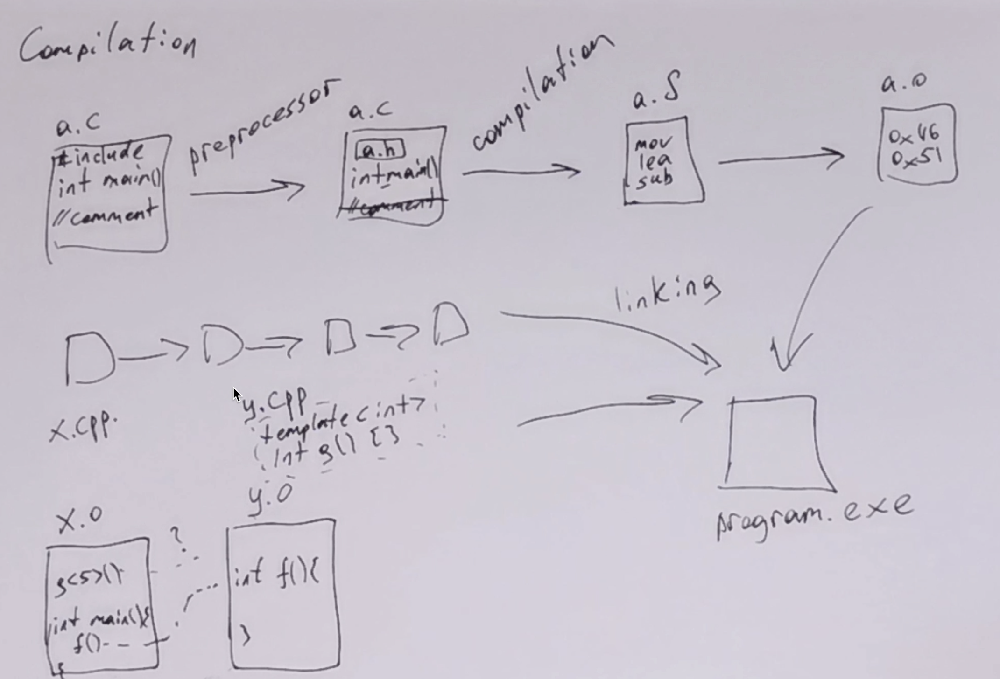

```python
!git add video.png
```

# Инструменты разработки

<table width=100%> <tr>
    <th width=20%> <b>Видеозапись семинара &rarr; </b> </th>
    <th>
    <a href="https://youtu.be/E8a0m6HG2x8">
         
    </a>
    </th>
    <th> </th>
 </table>


[Ридинг Яковлева](https://github.com/victor-yacovlev/mipt-diht-caos/blob/master/practice/linux_basics/devtools.md)


Сегодня в программе:
* <a href="#compile" style="color:#856024"> Компиляция и ее этапы </a>
  * <a href="#simple_compile" style="color:#856024"> Просто скомпилировать! </a>
  * <a href="#preprocess" style="color:#856024"> Прeпроцессинг </a>
  * <a href="#compilation" style="color:#856024"> Компиляция </a>
  * <a href="#assembling" style="color:#856024"> Acceмблирование </a>
  * <a href="#linking" style="color:#856024"> Компоновка </a>


* <a href="#elf" style="color:#856024"> Динамические библиотеки, объектные и исполняемые файлы </a>

* <a href="#run" style="color:#856024"> Запуск и завершение программы </a>

* <a href="#macro" style="color:#856024"> Дополнение: макросы в C/C++ </a>


## <a name="compile"></a> Компиляция и ее этапы

[Процесс компиляции программ на C++ / Хабр](https://habr.com/ru/post/478124/)

[Этапы компиляции / cppreference](https://en.cppreference.com/w/c/language/translation_phases) - тут выделены другие этапы, подробнее описано все про препроцессор.

Этапы компиляции:
1. Препроцессинг: разворачиваем инклюды и макросы
2. Компиляция: превращаем код на С/С++ в ассемблерный код
3. Ассемблирование: ассемблерный код -> машинный
4. Компоновка: сборка исполняемого файла из объектных файлов и статических библиотек

### <a name="simple_compile"></a> Просто скомпилировать!

Скомпилировать исходный код в исполняемый файл несложно: просто передаем все исходные файлы компилятору (файлы могут быть с разных этапов компиляции: исходные, после препроцессора, ассемблерный код (.S), объектные файлы (.o), ...)


```cpp
%%cpp hello_world.c
%run gcc hello_world.c -o hello_world_c.exe
%run ./hello_world_c.exe

#include <stdio.h>

int main() {
    printf("Hello world!\n");
    return 0;
}
```


Run: `gcc hello_world.c -o hello_world_c.exe`


Run: `./hello_world_c.exe`


    Hello world!


```cpp
%%cpp hello_world.cpp
%run g++ hello_world.cpp -o hello_world_cpp.exe
%run ./hello_world_cpp.exe

#include <iostream>

int main() {
    std::cout << "Hello world!\n";
    return 0;
}

```


Run: `g++ hello_world.cpp -o hello_world_cpp.exe`


Run: `./hello_world_cpp.exe`


    Hello world!


### <a name="preprocess"></a> Препроцессинг


```cpp
%%cpp preprocessing_max.h

int f(int a, int b);
```


```cpp
%%cpp preprocessing_max.c
%run gcc -E preprocessing_max.c -o preprocessing_max_E.c
%run cat preprocessing_max_E.c

#include "preprocessing_max.h"

// it's comment
#define max(a, b) ((a) > (b) ? (a) : (b))

int f(int a, int b) {
    return max(a, b);
}
```


Run: `gcc -E preprocessing_max.c -o preprocessing_max_E.c`


Run: `cat preprocessing_max_E.c`


    # 1 "preprocessing_max.c"
    # 1 "<built-in>"
    # 1 "<command-line>"
    # 31 "<command-line>"
    # 1 "/usr/include/stdc-predef.h" 1 3 4
    # 32 "<command-line>" 2
    # 1 "preprocessing_max.c"
    
    
    
    
    # 1 "preprocessing_max.h" 1
    
    
    int f(int a, int b);
    # 6 "preprocessing_max.c" 2
    
    
    
    
    int f(int a, int b) {
        return ((a) > (b) ? (a) : (b));
    }


Результат препроцессинга является корректным кодом, его можно использовать так же, как и обычный код. Просто теперь в нем раскрыты все инструкции препроцессора


```cpp
%%cpp preprocessing_max_main.c
%run gcc preprocessing_max_main.c preprocessing_max_E.c -o preprocessing_max.exe
%run ./preprocessing_max.exe

#include "preprocessing_max.h"

#include <stdio.h>

int main() {
    printf("max(5, 7) = %d\n", f(5, 7));
    return 0;
}
```


Run: `gcc preprocessing_max_main.c preprocessing_max_E.c -o preprocessing_max.exe`


Run: `./preprocessing_max.exe`


    max(5, 7) = 7


### <a name="compilation"></a> Компиляция

Превратим исходный код в ассемблерный.


```python
# здесь необязательно брать результат работы препроцессора
# -Os -fno-asynchronous-unwind-tables помогает получить более короткий выхлоп
# -fverbose-asm позволит получить более длинный, но более удобный для чтения
!gcc -S preprocessing_max_E.c -Os -fno-asynchronous-unwind-tables -o preprocessing_max_E.S  
!cat preprocessing_max_E.S 
```

    	.file	"preprocessing_max_E.c"
    	.text
    	.globl	f
    	.type	f, @function
    f:
    	endbr64
    	cmpl	%edi, %esi
    	movl	%edi, %eax
    	cmovge	%esi, %eax
    	ret
    	.size	f, .-f
    	.ident	"GCC: (Ubuntu 9.3.0-10ubuntu2) 9.3.0"
    	.section	.note.GNU-stack,"",@progbits
    	.section	.note.gnu.property,"a"
    	.align 8
    	.long	 1f - 0f
    	.long	 4f - 1f
    	.long	 5
    0:
    	.string	 "GNU"
    1:
    	.align 8
    	.long	 0xc0000002
    	.long	 3f - 2f
    2:
    	.long	 0x3
    3:
    	.align 8
    4:


Способ получить ассемблерный код функции. Правда тут не просто проводится компиляция, здесь создается машинный код, а потом gdb его обратно дизассемблирует.


```python
!gcc -c preprocessing_max_E.c -Os -o preprocessing_max.o
!gdb preprocessing_max.o -batch -ex="disass f"
```

    Dump of assembler code for function f:
       0x0000000000000000 <+0>:	endbr64 
       0x0000000000000004 <+4>:	cmp    %edi,%esi
       0x0000000000000006 <+6>:	mov    %edi,%eax
       0x0000000000000008 <+8>:	cmovge %esi,%eax
       0x000000000000000b <+11>:	retq   
    End of assembler dump.


### <a name="assembling"></a> Ассемблирование

Ничего интересного, ассемблер и так слишком приближен к машинному коду. (Возможно этой фазы вообще нет при каких-то условиях компиляции).


```python
!gcc -c preprocessing_max_E.S -o preprocessing_max.o
```

### <a name="linking"></a> Компоновка / Линковка

Финальная сборка одного исполняемого файла

Она производится утилитой `ld`, но проще ее не запоминать и пользоваться gcc, который сам ее вызовет


```python
!gcc preprocessing_max.o preprocessing_max_main.c -o preprocessing_max_main.exe
!./preprocessing_max_main.exe
```

    max(5, 7) = 7


```python

```

ddd


```cpp
%%cpp a.c

int g(int x) {
    return x * x;
}

```


```cpp
%%cpp b.c

#include <stdio.h>

int g(float);

int main() {
    printf("g(5) = %d\n", g(5.0));
    return 0;
}
```


```python
!gcc a.c b.c -o a.exe && ./a.exe
```

    [01m[Ka.c:5:5:[m[K [01;31m[Kerror: [m[Kconflicting types for ‘[01m[Kg[m[K’
        5 | int [01;31m[Kg[m[K(int x) {
          |     [01;31m[K^[m[K
    [01m[Ka.c:3:5:[m[K [01;36m[Knote: [m[Kprevious declaration of ‘[01m[Kg[m[K’ was here
        3 | int [01;36m[Kg[m[K(float);
          |     [01;36m[K^[m[K


## <a name="elf"></a> Динамические библиотеки, объектные и исполняемые файлы


[ELF / Wiki](https://en.wikipedia.org/wiki/Executable_and_Linkable_Format) - Executable and Linkable Format


```cpp
%%cpp lib.c
%run gcc -c lib.c -o lib.o #// компилируем в объектный файл
%run ar rcs lib.a lib.o #// делаем из объектного файла статическую библиотеку (что по сути архив объектных файлов)
%run gcc -shared -fPIC lib.o -o lib.so #// делаем из объектного файла динамическую библиотеку

int sum(int a, int b) {
    return a + b;
}

float sum_f(float a, float b) {
    return a + b;
}
```


Run: `gcc -c lib.c -o lib.o #// компилируем в объектный файл`


Run: `ar rcs lib.a lib.o #// делаем из объектного файла статическую библиотеку (что по сути архив объектных файлов)`


Run: `gcc -shared -fPIC lib.o -o lib.so #// делаем из объектного файла динамическую библиотеку`


```python
!hexdump -C lib.o | head -n 2  # обратите внимание на 0x7f E L F - магическое начало файла
```

    00000000  7f 45 4c 46 02 01 01 00  00 00 00 00 00 00 00 00  |.ELF............|
    00000010  01 00 3e 00 01 00 00 00  00 00 00 00 00 00 00 00  |..>.............|


```python
!hexdump -C lib.a | head -n 2 # заметим, что это не ELF но тоже имеет магическое начало
!hexdump -C lib.so | head -n 2 # а это тоже ELF
```

    00000000  21 3c 61 72 63 68 3e 0a  2f 20 20 20 20 20 20 20  |!<arch>./       |
    00000010  20 20 20 20 20 20 20 20  30 20 20 20 20 20 20 20  |        0       |
    00000000  7f 45 4c 46 02 01 01 00  00 00 00 00 00 00 00 00  |.ELF............|
    00000010  03 00 3e 00 01 00 00 00  40 10 00 00 00 00 00 00  |..>.....@.......|


```python
!hexdump -C preprocessing_max.exe | head -n 2 # а это тоже ELF
```

    00000000  7f 45 4c 46 02 01 01 00  00 00 00 00 00 00 00 00  |.ELF............|
    00000010  03 00 3e 00 01 00 00 00  60 10 00 00 00 00 00 00  |..>.....`.......|


```python
!objdump -t lib.o | grep sum  # symbols in shared library
```

    0000000000000000 g     F .text	0000000000000018 sum
    0000000000000018 g     F .text	000000000000001e sum_f


```python
!objdump -t lib.so | grep sum  # symbols in shared library
```

    0000000000001111 g     F .text	000000000000001e sum_f
    00000000000010f9 g     F .text	0000000000000018 sum


```cpp
%%cpp main.c
%run gcc main.c lib.a -o main.exe
%run ./main.exe

#include <stdio.h>

int sum(int a, int b);

int main() {
    printf("%d", sum(1, 2));
    return 0;
}
```


Run: `gcc main.c lib.a -o main.exe`


Run: `./main.exe`


    3


```python

```

Подгрузим динамическую библиотеку из Python


```python
import ctypes

lib = ctypes.CDLL("./lib.so")
%p lib.sum(3, 4)
%p lib.sum_f(3, 4)

lib.sum_f.restype = ctypes.c_float
%p lib.sum_f(3, 4) # with set return type

lib.sum_f.argtypes = [ctypes.c_float, ctypes.c_float]
%p lib.sum_f(3, 4) # with set return and arguments types
```


lib.sum(3, 4) = 7


lib.sum_f(3, 4) = 0


`lib.sum_f(3, 4) = 1.3243189739662118e-38`  # with set return type


`lib.sum_f(3, 4) = 7.0`  # with set return and arguments types


```python

```

## <a name="run"></a> Запуск и завершение программы

[Интересная статья про запуск и завершение программы](http://dbp-consulting.com/tutorials/debugging/linuxProgramStartup.html)


    
    
Пример из статьи.


```cpp
%%cpp article_example.c
%run gcc article_example.c -o article_example.exe
%run ./article_example.exe

#include <stdio.h>
#include <stdlib.h>

void preinit(int argc, char **argv, char **envp) {
    printf("%s\n", __FUNCTION__);
}

void init(int argc, char **argv, char **envp) {
    printf("%s\n", __FUNCTION__);
}

void fini() {
    printf("%s\n", __FUNCTION__);
}

__attribute__((section(".init_array"))) typeof(init) *__init = init;
__attribute__((section(".preinit_array"))) typeof(preinit) *__preinit = preinit;
__attribute__((section(".fini_array"))) typeof(fini) *__fini = fini;

void  __attribute__ ((constructor)) constructor() {
    printf("%s\n", __FUNCTION__);
}

void __attribute__ ((destructor)) destructor() {
    printf("%s\n", __FUNCTION__);
}

void my_atexit() {
    printf("%s\n", __FUNCTION__);
}

void my_atexit2() {
    printf("%s\n", __FUNCTION__);
}

int main() {
    printf("%s 1\n", __FUNCTION__);
    atexit(my_atexit);
    atexit(my_atexit2);
    printf("%s 2\n", __FUNCTION__);
}
```


Run: `gcc article_example.c -o article_example.exe`


Run: `./article_example.exe`


    preinit
    init
    constructor
    main 1
    main 2
    my_atexit2
    my_atexit
    destructor
    fini


А вы думали программы без `main` не бывает?

`sudo apt-get install libc6-dev-amd64` - надо установить, чтобы `sys/syscall.h` нашелся. 


```cpp
%%cpp no_main_func.c
%run gcc -std=gnu11 -m32 -masm=intel -nostdlib -O3 no_main_func.c -o no_main_func.exe
%run ./no_main_func.exe

#include <sys/syscall.h>

    
// Универсальная функция для совершения системных вызовов
int syscall(int code, ...);
__asm__(R"(
syscall:
    push ebx
    push ebp
    push esi
    push edi
    mov eax, DWORD PTR [esp + 20] 
    mov ebx, DWORD PTR [esp + 24] 
    mov ecx, DWORD PTR [esp + 28] 
    mov edx, DWORD PTR [esp + 32]
    mov esi, DWORD PTR [esp + 36]
    mov edi, DWORD PTR [esp + 40]
    int 0x80
    pop edi
    pop esi
    pop ebp
    pop ebx
    ret
)");

// запись строки в файловый дескриптор
int print_s(int fd, const char* s) {
    int len = 0;
    while (s[len]) ++len;
    return syscall(SYS_write, fd, s, len);
}

void _start() {
    print_s(1, "Hello world from 'syscall'!\n");
    syscall(SYS_exit, 0);
}
```


Run: `gcc -std=gnu11 -m32 -masm=intel -nostdlib -O3 no_main_func.c -o no_main_func.exe`


Run: `./no_main_func.exe`


    Hello world from 'syscall'!


```cpp
%%cpp main_func.c
%run gcc -std=gnu11 -O3 main_func.c -o main_func.exe
%run ./main_func.exe

#include <stdio.h>

int main() {
    printf("Hello world from 'syscall'!\n");
    return 0;
}
```


Run: `gcc -std=gnu11 -O3 main_func.c -o main_func.exe`


Run: `./main_func.exe`


    Hello world from 'syscall'!


```python
!stat ./no_main_func.exe
!stat ./main_func.exe
```

      File: ./no_main_func.exe
      Size: 13708     	Blocks: 32         IO Block: 4096   regular file
    Device: 805h/2053d	Inode: 4724956     Links: 1
    Access: (0775/-rwxrwxr-x)  Uid: ( 1000/pechatnov)   Gid: ( 1000/pechatnov)
    Access: 2020-09-10 17:58:16.610268179 +0300
    Modify: 2020-09-10 17:58:16.450266380 +0300
    Change: 2020-09-10 17:58:16.450266380 +0300
     Birth: -
      File: ./main_func.exe
      Size: 16696     	Blocks: 40         IO Block: 4096   regular file
    Device: 805h/2053d	Inode: 4724991     Links: 1
    Access: (0775/-rwxrwxr-x)  Uid: ( 1000/pechatnov)   Gid: ( 1000/pechatnov)
    Access: 2020-09-10 17:59:12.250893117 +0300
    Modify: 2020-09-10 17:59:12.062891002 +0300
    Change: 2020-09-10 17:59:12.062891002 +0300
     Birth: -


## <a name="macro"></a> Дополнение: макросы в C/C++ </a>

[Статья про макросы / opennet](https://www.opennet.ru/docs/RUS/cpp/cpp-5.html)

* 

<details> <summary> Почему использование макросов стоит минимизировать </summary>
  <pre> <code> 
Тимур Демченко
расскажите, пожалуйста, почему объявление констант в c++ через define считается плохим кодстайлом
Yuri Pechatnov
Макросы в принципе считаются плохим кодстайлом, но они очень полезны бывают
Но не в случае #define CONST 5, так как это хорошо заменяется на constexpr int CONST = 5;
Mikhail Tsion
Because all macros (which are what #defines define) are in a single namespace and they take effect everywhere. Variables, including const-qualified variables, can be encapsulated in classes and namespaces.
Macros are used in C because in C, a const-qualified variable is not actually a constant, it is just a variable that cannot be modified. A const-qualified variable cannot appear in a constant expression, so it can't be used as an array size, for example.
In C++, a const-qualified object that is initialized with a constant expression (like const int x = 5 * 2;) is a constant and can be used in a constant expression, so you can and should use them.
Yuri Pechatnov
Ну и они вне неймспейсов, да
Если использовать много библиотек, то можно наткнуться на клеш дефайнов, или получить еще что-то удивительное в плохом смысле
  </code> </pre>
</details>


* Макросы это именно макросы, они ничего не знают про синтаксис С/С++


```cpp
%%cpp macro_example_0.c
%run gcc -E macro_example_0.c -o macro_example_0_E.c
%run cat macro_example_0_E.c

#define people students and students
#define goodbye(x) Good bye x! 

Hello people!
#undef people
Hello people!
goodbye(bad grades)
```


Run: `gcc -E macro_example_0.c -o macro_example_0_E.c`


Run: `cat macro_example_0_E.c`


    # 1 "macro_example_0.c"
    # 1 "<built-in>"
    # 1 "<command-line>"
    # 31 "<command-line>"
    # 1 "/usr/include/stdc-predef.h" 1 3 4
    # 32 "<command-line>" 2
    # 1 "macro_example_0.c"
    
    
    
    
    
    
    
    Hello students and students!
    
    Hello people!
    Good bye bad grades!


* Переменные в макросах это просто куски исходного текста
* При передаче аргументов в макрос стоит помнить, что значение имеют только запятые `,` и скобки `()`


```cpp
%%cpp macro_example_0_2.c
%run gcc -E macro_example_0_2.c -o macro_example_0_2_E.c
%run cat macro_example_0_2_E.c

#define macro(type, var, value) type var = value;

// #define protect(...) __VA_ARGS__

macro(protect(std::pair<int, int>), a, protect({1, 2, 3}))
```


Run: `gcc -E macro_example_0_2.c -o macro_example_0_2_E.c`


Run: `cat macro_example_0_2_E.c`


    # 1 "macro_example_0_2.c"
    # 1 "<built-in>"
    # 1 "<command-line>"
    # 31 "<command-line>"
    # 1 "/usr/include/stdc-predef.h" 1 3 4
    # 32 "<command-line>" 2
    # 1 "macro_example_0_2.c"
    # 9 "macro_example_0_2.c"
    protect(std::pair<int, int>) a = protect({1, 2, 3});


Больше примеров


```cpp
%%cpp macro_example.c
%run gcc macro_example.c -o macro_example.exe
%run ./macro_example.exe
%run gcc -DDEBUG macro_example.c -o macro_example.exe
%run ./macro_example.exe

#include <stdio.h>

#if !defined(DEBUG)
//#ifndef DEBUG
    #define DEBUG 0
#endif


#define CONST_A 123

#define mult(a, b) ((a) * (b))

#define mult_bad(a, b) (a * b)

// Склеивание имен
#define add_prefix_aba_(w) aba_##w

int main() {
    printf("START\n");
    #if DEBUG
        const char* file_name = "001.txt";
        printf("Read from '%s'. DEBUG define is enabled!\n", file_name);
        freopen(file_name, "rt", stdin);
    #endif

    printf("CONST_A %d\n", CONST_A);
    printf("mult(4, 6) = %d\n", mult(2 + 2, 3 + 3));
    printf("mult_bad(4, 6) = %d\n", mult_bad(2 + 2, 3 + 3));

    int aba_x = 42;
    int x = 420;
    printf("aba_x ? x = %d\n", add_prefix_aba_(x)); // aba_x
    
    printf("DEBUG = %d\n", DEBUG);

    return 0;
}
```


Run: `gcc macro_example.c -o macro_example.exe`


Run: `./macro_example.exe`


    START
    CONST_A 123
    mult(4, 6) = 24
    mult_bad(4, 6) = 11
    aba_x ? x = 42
    DEBUG = 0


Run: `gcc -DDEBUG macro_example.c -o macro_example.exe`


Run: `./macro_example.exe`


    START
    Read from '001.txt'. DEBUG define is enabled!
    CONST_A 123
    mult(4, 6) = 24
    mult_bad(4, 6) = 11
    aba_x ? x = 42
    DEBUG = 1


И полезных примеров:


```cpp
%%cpp macro_example_2.c
%run cat macro_example_2.c | grep -v "// %" > macro_example_2_filtered.c
%run gcc -std=c99 -ansi macro_example_2_filtered.c -o macro_example_2.exe
%run ./macro_example_2.exe
%run gcc -std=gnu99 macro_example_2.c -o macro_example_2.exe
%run ./macro_example_2.exe

#include <stdio.h>
#include <string.h>
#include <assert.h>

/* #VAR_NAME разворачивается в строковый литерал "VAR_NAME" */
#define print_int(i) printf(#i " = %d\n", (i));

/* Полезный макрос для вывода в поток ошибок */
#define eprintf(...) fprintf(stderr, __VA_ARGS__)

#define logprintf_impl(fmt, line, ...) eprintf(__FILE__ ":" #line " " fmt, __VA_ARGS__)
#define logprintf_impl_2(fmt, line, ...) logprintf_impl(fmt, line, __VA_ARGS__)
#define logprintf(fmt, ...) logprintf_impl_2(fmt, __LINE__, __VA_ARGS__)

#define SWAP(a, b) { __typeof__(a) c = (a); (a) = (b); (b) = (c); }
#define SWAP2(a, b) { char c[sizeof(a)]; memcpy(c, &a, sizeof(a)); \
                      memcpy(&a, &b, sizeof(a)); memcpy(&b, c, sizeof(a)); if (0) { a = b; b = a; } }

/* Способ сделать макрос с переменным числом аргументов
 * И это единственный способ "перегрузить функцию в С" */
#define sum_2(a, b, c) ((a) + (b))
#define sum_3(a, b, c) ((a) + (b) + (c))

#define sum_impl(a, b, c, sum_func, ...) sum_func(a, b, c)

#define sum(...) sum_impl(__VA_ARGS__, sum_3, sum_2)


int main() {
    /* assert(3 > 4); */
    print_int(9 * 9 + 1);

    eprintf("It is in stderr: %d\n", 431);

    int x = 1, y = 2;
    eprintf("(x, y) = (%d, %d)\n", x, y);
    SWAP(x, y);
    eprintf("(x, y) = (%d, %d)\n", x, y);
    SWAP2(x, y);
    eprintf("(x, y) = (%d, %d)\n", x, y);

    print_int(sum(1, 1));
    print_int(sum(1, 1, 1));
    
    eprintf("%s %s %d\n", __FILE__, __FUNCTION__, __LINE__);
    
    logprintf("Before exit %s\n", "");
    return 0;
}
```


Run: `cat macro_example_2.c | grep -v "// %" > macro_example_2_filtered.c`


Run: `gcc -std=c99 -ansi macro_example_2_filtered.c -o macro_example_2.exe`


Run: `./macro_example_2.exe`


    9 * 9 + 1 = 82
    It is in stderr: 431
    (x, y) = (1, 2)
    (x, y) = (2, 1)
    (x, y) = (1, 2)
    sum(1, 1) = 2
    sum(1, 1, 1) = 3
    macro_example_2_filtered.c main 46
    macro_example_2_filtered.c:48 Before exit 


Run: `gcc -std=gnu99 macro_example_2.c -o macro_example_2.exe`


Run: `./macro_example_2.exe`


    9 * 9 + 1 = 82
    It is in stderr: 431
    (x, y) = (1, 2)
    (x, y) = (2, 1)
    (x, y) = (1, 2)
    sum(1, 1) = 2
    sum(1, 1, 1) = 3
    macro_example_2.c main 52
    macro_example_2.c:54 Before exit 


```python
!gcc -E macro_example_2.c -o out &&  cat out
```

    # 1 "macro_example_2.c"
    # 1 "<built-in>"
    # 1 "<command-line>"
    # 31 "<command-line>"
    # 1 "/usr/include/stdc-predef.h" 1 3 4
    # 32 "<command-line>" 2
    # 1 "macro_example_2.c"
    
    
    
    
    
    
    
    # 1 "/usr/include/stdio.h" 1 3 4
    # 27 "/usr/include/stdio.h" 3 4
    # 1 "/usr/include/x86_64-linux-gnu/bits/libc-header-start.h" 1 3 4
    # 33 "/usr/include/x86_64-linux-gnu/bits/libc-header-start.h" 3 4
    # 1 "/usr/include/features.h" 1 3 4
    # 461 "/usr/include/features.h" 3 4
    # 1 "/usr/include/x86_64-linux-gnu/sys/cdefs.h" 1 3 4
    # 452 "/usr/include/x86_64-linux-gnu/sys/cdefs.h" 3 4
    # 1 "/usr/include/x86_64-linux-gnu/bits/wordsize.h" 1 3 4
    # 453 "/usr/include/x86_64-linux-gnu/sys/cdefs.h" 2 3 4
    # 1 "/usr/include/x86_64-linux-gnu/bits/long-double.h" 1 3 4
    # 454 "/usr/include/x86_64-linux-gnu/sys/cdefs.h" 2 3 4
    # 462 "/usr/include/features.h" 2 3 4
    # 485 "/usr/include/features.h" 3 4
    # 1 "/usr/include/x86_64-linux-gnu/gnu/stubs.h" 1 3 4
    # 10 "/usr/include/x86_64-linux-gnu/gnu/stubs.h" 3 4
    # 1 "/usr/include/x86_64-linux-gnu/gnu/stubs-64.h" 1 3 4
    # 11 "/usr/include/x86_64-linux-gnu/gnu/stubs.h" 2 3 4
    # 486 "/usr/include/features.h" 2 3 4
    # 34 "/usr/include/x86_64-linux-gnu/bits/libc-header-start.h" 2 3 4
    # 28 "/usr/include/stdio.h" 2 3 4
    
    
    
    
    
    # 1 "/usr/lib/gcc/x86_64-linux-gnu/9/include/stddef.h" 1 3 4
    # 209 "/usr/lib/gcc/x86_64-linux-gnu/9/include/stddef.h" 3 4
    
    # 209 "/usr/lib/gcc/x86_64-linux-gnu/9/include/stddef.h" 3 4
    typedef long unsigned int size_t;
    # 34 "/usr/include/stdio.h" 2 3 4
    
    
    # 1 "/usr/lib/gcc/x86_64-linux-gnu/9/include/stdarg.h" 1 3 4
    # 40 "/usr/lib/gcc/x86_64-linux-gnu/9/include/stdarg.h" 3 4
    typedef __builtin_va_list __gnuc_va_list;
    # 37 "/usr/include/stdio.h" 2 3 4
    
    # 1 "/usr/include/x86_64-linux-gnu/bits/types.h" 1 3 4
    # 27 "/usr/include/x86_64-linux-gnu/bits/types.h" 3 4
    # 1 "/usr/include/x86_64-linux-gnu/bits/wordsize.h" 1 3 4
    # 28 "/usr/include/x86_64-linux-gnu/bits/types.h" 2 3 4
    # 1 "/usr/include/x86_64-linux-gnu/bits/timesize.h" 1 3 4
    # 29 "/usr/include/x86_64-linux-gnu/bits/types.h" 2 3 4
    
    
    typedef unsigned char __u_char;
    typedef unsigned short int __u_short;
    typedef unsigned int __u_int;
    typedef unsigned long int __u_long;
    
    
    typedef signed char __int8_t;
    typedef unsigned char __uint8_t;
    typedef signed short int __int16_t;
    typedef unsigned short int __uint16_t;
    typedef signed int __int32_t;
    typedef unsigned int __uint32_t;
    
    typedef signed long int __int64_t;
    typedef unsigned long int __uint64_t;
    
    
    
    
    
    
    typedef __int8_t __int_least8_t;
    typedef __uint8_t __uint_least8_t;
    typedef __int16_t __int_least16_t;
    typedef __uint16_t __uint_least16_t;
    typedef __int32_t __int_least32_t;
    typedef __uint32_t __uint_least32_t;
    typedef __int64_t __int_least64_t;
    typedef __uint64_t __uint_least64_t;
    
    
    
    typedef long int __quad_t;
    typedef unsigned long int __u_quad_t;
    
    
    
    
    
    
    
    typedef long int __intmax_t;
    typedef unsigned long int __uintmax_t;
    # 141 "/usr/include/x86_64-linux-gnu/bits/types.h" 3 4
    # 1 "/usr/include/x86_64-linux-gnu/bits/typesizes.h" 1 3 4
    # 142 "/usr/include/x86_64-linux-gnu/bits/types.h" 2 3 4
    # 1 "/usr/include/x86_64-linux-gnu/bits/time64.h" 1 3 4
    # 143 "/usr/include/x86_64-linux-gnu/bits/types.h" 2 3 4
    
    
    typedef unsigned long int __dev_t;
    typedef unsigned int __uid_t;
    typedef unsigned int __gid_t;
    typedef unsigned long int __ino_t;
    typedef unsigned long int __ino64_t;
    typedef unsigned int __mode_t;
    typedef unsigned long int __nlink_t;
    typedef long int __off_t;
    typedef long int __off64_t;
    typedef int __pid_t;
    typedef struct { int __val[2]; } __fsid_t;
    typedef long int __clock_t;
    typedef unsigned long int __rlim_t;
    typedef unsigned long int __rlim64_t;
    typedef unsigned int __id_t;
    typedef long int __time_t;
    typedef unsigned int __useconds_t;
    typedef long int __suseconds_t;
    
    typedef int __daddr_t;
    typedef int __key_t;
    
    
    typedef int __clockid_t;
    
    
    typedef void * __timer_t;
    
    
    typedef long int __blksize_t;
    
    
    
    
    typedef long int __blkcnt_t;
    typedef long int __blkcnt64_t;
    
    
    typedef unsigned long int __fsblkcnt_t;
    typedef unsigned long int __fsblkcnt64_t;
    
    
    typedef unsigned long int __fsfilcnt_t;
    typedef unsigned long int __fsfilcnt64_t;
    
    
    typedef long int __fsword_t;
    
    typedef long int __ssize_t;
    
    
    typedef long int __syscall_slong_t;
    
    typedef unsigned long int __syscall_ulong_t;
    
    
    
    typedef __off64_t __loff_t;
    typedef char *__caddr_t;
    
    
    typedef long int __intptr_t;
    
    
    typedef unsigned int __socklen_t;
    
    
    
    
    typedef int __sig_atomic_t;
    # 39 "/usr/include/stdio.h" 2 3 4
    # 1 "/usr/include/x86_64-linux-gnu/bits/types/__fpos_t.h" 1 3 4
    
    
    
    
    # 1 "/usr/include/x86_64-linux-gnu/bits/types/__mbstate_t.h" 1 3 4
    # 13 "/usr/include/x86_64-linux-gnu/bits/types/__mbstate_t.h" 3 4
    typedef struct
    {
      int __count;
      union
      {
        unsigned int __wch;
        char __wchb[4];
      } __value;
    } __mbstate_t;
    # 6 "/usr/include/x86_64-linux-gnu/bits/types/__fpos_t.h" 2 3 4
    
    
    
    
    typedef struct _G_fpos_t
    {
      __off_t __pos;
      __mbstate_t __state;
    } __fpos_t;
    # 40 "/usr/include/stdio.h" 2 3 4
    # 1 "/usr/include/x86_64-linux-gnu/bits/types/__fpos64_t.h" 1 3 4
    # 10 "/usr/include/x86_64-linux-gnu/bits/types/__fpos64_t.h" 3 4
    typedef struct _G_fpos64_t
    {
      __off64_t __pos;
      __mbstate_t __state;
    } __fpos64_t;
    # 41 "/usr/include/stdio.h" 2 3 4
    # 1 "/usr/include/x86_64-linux-gnu/bits/types/__FILE.h" 1 3 4
    
    
    
    struct _IO_FILE;
    typedef struct _IO_FILE __FILE;
    # 42 "/usr/include/stdio.h" 2 3 4
    # 1 "/usr/include/x86_64-linux-gnu/bits/types/FILE.h" 1 3 4
    
    
    
    struct _IO_FILE;
    
    
    typedef struct _IO_FILE FILE;
    # 43 "/usr/include/stdio.h" 2 3 4
    # 1 "/usr/include/x86_64-linux-gnu/bits/types/struct_FILE.h" 1 3 4
    # 35 "/usr/include/x86_64-linux-gnu/bits/types/struct_FILE.h" 3 4
    struct _IO_FILE;
    struct _IO_marker;
    struct _IO_codecvt;
    struct _IO_wide_data;
    
    
    
    
    typedef void _IO_lock_t;
    
    
    
    
    
    struct _IO_FILE
    {
      int _flags;
    
    
      char *_IO_read_ptr;
      char *_IO_read_end;
      char *_IO_read_base;
      char *_IO_write_base;
      char *_IO_write_ptr;
      char *_IO_write_end;
      char *_IO_buf_base;
      char *_IO_buf_end;
    
    
      char *_IO_save_base;
      char *_IO_backup_base;
      char *_IO_save_end;
    
      struct _IO_marker *_markers;
    
      struct _IO_FILE *_chain;
    
      int _fileno;
      int _flags2;
      __off_t _old_offset;
    
    
      unsigned short _cur_column;
      signed char _vtable_offset;
      char _shortbuf[1];
    
      _IO_lock_t *_lock;
    
    
    
    
    
    
    
      __off64_t _offset;
    
      struct _IO_codecvt *_codecvt;
      struct _IO_wide_data *_wide_data;
      struct _IO_FILE *_freeres_list;
      void *_freeres_buf;
      size_t __pad5;
      int _mode;
    
      char _unused2[15 * sizeof (int) - 4 * sizeof (void *) - sizeof (size_t)];
    };
    # 44 "/usr/include/stdio.h" 2 3 4
    # 52 "/usr/include/stdio.h" 3 4
    typedef __gnuc_va_list va_list;
    # 63 "/usr/include/stdio.h" 3 4
    typedef __off_t off_t;
    # 77 "/usr/include/stdio.h" 3 4
    typedef __ssize_t ssize_t;
    
    
    
    
    
    
    typedef __fpos_t fpos_t;
    # 133 "/usr/include/stdio.h" 3 4
    # 1 "/usr/include/x86_64-linux-gnu/bits/stdio_lim.h" 1 3 4
    # 134 "/usr/include/stdio.h" 2 3 4
    
    
    
    extern FILE *stdin;
    extern FILE *stdout;
    extern FILE *stderr;
    
    
    
    
    
    
    extern int remove (const char *__filename) __attribute__ ((__nothrow__ , __leaf__));
    
    extern int rename (const char *__old, const char *__new) __attribute__ ((__nothrow__ , __leaf__));
    
    
    
    extern int renameat (int __oldfd, const char *__old, int __newfd,
           const char *__new) __attribute__ ((__nothrow__ , __leaf__));
    # 173 "/usr/include/stdio.h" 3 4
    extern FILE *tmpfile (void) ;
    # 187 "/usr/include/stdio.h" 3 4
    extern char *tmpnam (char *__s) __attribute__ ((__nothrow__ , __leaf__)) ;
    
    
    
    
    extern char *tmpnam_r (char *__s) __attribute__ ((__nothrow__ , __leaf__)) ;
    # 204 "/usr/include/stdio.h" 3 4
    extern char *tempnam (const char *__dir, const char *__pfx)
         __attribute__ ((__nothrow__ , __leaf__)) __attribute__ ((__malloc__)) ;
    
    
    
    
    
    
    
    extern int fclose (FILE *__stream);
    
    
    
    
    extern int fflush (FILE *__stream);
    # 227 "/usr/include/stdio.h" 3 4
    extern int fflush_unlocked (FILE *__stream);
    # 246 "/usr/include/stdio.h" 3 4
    extern FILE *fopen (const char *__restrict __filename,
          const char *__restrict __modes) ;
    
    
    
    
    extern FILE *freopen (const char *__restrict __filename,
            const char *__restrict __modes,
            FILE *__restrict __stream) ;
    # 279 "/usr/include/stdio.h" 3 4
    extern FILE *fdopen (int __fd, const char *__modes) __attribute__ ((__nothrow__ , __leaf__)) ;
    # 292 "/usr/include/stdio.h" 3 4
    extern FILE *fmemopen (void *__s, size_t __len, const char *__modes)
      __attribute__ ((__nothrow__ , __leaf__)) ;
    
    
    
    
    extern FILE *open_memstream (char **__bufloc, size_t *__sizeloc) __attribute__ ((__nothrow__ , __leaf__)) ;
    
    
    
    
    
    extern void setbuf (FILE *__restrict __stream, char *__restrict __buf) __attribute__ ((__nothrow__ , __leaf__));
    
    
    
    extern int setvbuf (FILE *__restrict __stream, char *__restrict __buf,
          int __modes, size_t __n) __attribute__ ((__nothrow__ , __leaf__));
    
    
    
    
    extern void setbuffer (FILE *__restrict __stream, char *__restrict __buf,
             size_t __size) __attribute__ ((__nothrow__ , __leaf__));
    
    
    extern void setlinebuf (FILE *__stream) __attribute__ ((__nothrow__ , __leaf__));
    
    
    
    
    
    
    
    extern int fprintf (FILE *__restrict __stream,
          const char *__restrict __format, ...);
    
    
    
    
    extern int printf (const char *__restrict __format, ...);
    
    extern int sprintf (char *__restrict __s,
          const char *__restrict __format, ...) __attribute__ ((__nothrow__));
    
    
    
    
    
    extern int vfprintf (FILE *__restrict __s, const char *__restrict __format,
           __gnuc_va_list __arg);
    
    
    
    
    extern int vprintf (const char *__restrict __format, __gnuc_va_list __arg);
    
    extern int vsprintf (char *__restrict __s, const char *__restrict __format,
           __gnuc_va_list __arg) __attribute__ ((__nothrow__));
    
    
    
    extern int snprintf (char *__restrict __s, size_t __maxlen,
           const char *__restrict __format, ...)
         __attribute__ ((__nothrow__)) __attribute__ ((__format__ (__printf__, 3, 4)));
    
    extern int vsnprintf (char *__restrict __s, size_t __maxlen,
            const char *__restrict __format, __gnuc_va_list __arg)
         __attribute__ ((__nothrow__)) __attribute__ ((__format__ (__printf__, 3, 0)));
    # 379 "/usr/include/stdio.h" 3 4
    extern int vdprintf (int __fd, const char *__restrict __fmt,
           __gnuc_va_list __arg)
         __attribute__ ((__format__ (__printf__, 2, 0)));
    extern int dprintf (int __fd, const char *__restrict __fmt, ...)
         __attribute__ ((__format__ (__printf__, 2, 3)));
    
    
    
    
    
    
    
    extern int fscanf (FILE *__restrict __stream,
         const char *__restrict __format, ...) ;
    
    
    
    
    extern int scanf (const char *__restrict __format, ...) ;
    
    extern int sscanf (const char *__restrict __s,
         const char *__restrict __format, ...) __attribute__ ((__nothrow__ , __leaf__));
    
    
    
    
    
    
    extern int fscanf (FILE *__restrict __stream, const char *__restrict __format, ...) __asm__ ("" "__isoc99_fscanf")
    
                                   ;
    extern int scanf (const char *__restrict __format, ...) __asm__ ("" "__isoc99_scanf")
                                  ;
    extern int sscanf (const char *__restrict __s, const char *__restrict __format, ...) __asm__ ("" "__isoc99_sscanf") __attribute__ ((__nothrow__ , __leaf__))
    
                          ;
    # 432 "/usr/include/stdio.h" 3 4
    extern int vfscanf (FILE *__restrict __s, const char *__restrict __format,
          __gnuc_va_list __arg)
         __attribute__ ((__format__ (__scanf__, 2, 0))) ;
    
    
    
    
    
    extern int vscanf (const char *__restrict __format, __gnuc_va_list __arg)
         __attribute__ ((__format__ (__scanf__, 1, 0))) ;
    
    
    extern int vsscanf (const char *__restrict __s,
          const char *__restrict __format, __gnuc_va_list __arg)
         __attribute__ ((__nothrow__ , __leaf__)) __attribute__ ((__format__ (__scanf__, 2, 0)));
    
    
    
    
    extern int vfscanf (FILE *__restrict __s, const char *__restrict __format, __gnuc_va_list __arg) __asm__ ("" "__isoc99_vfscanf")
    
    
    
         __attribute__ ((__format__ (__scanf__, 2, 0))) ;
    extern int vscanf (const char *__restrict __format, __gnuc_va_list __arg) __asm__ ("" "__isoc99_vscanf")
    
         __attribute__ ((__format__ (__scanf__, 1, 0))) ;
    extern int vsscanf (const char *__restrict __s, const char *__restrict __format, __gnuc_va_list __arg) __asm__ ("" "__isoc99_vsscanf") __attribute__ ((__nothrow__ , __leaf__))
    
    
    
         __attribute__ ((__format__ (__scanf__, 2, 0)));
    # 485 "/usr/include/stdio.h" 3 4
    extern int fgetc (FILE *__stream);
    extern int getc (FILE *__stream);
    
    
    
    
    
    extern int getchar (void);
    
    
    
    
    
    
    extern int getc_unlocked (FILE *__stream);
    extern int getchar_unlocked (void);
    # 510 "/usr/include/stdio.h" 3 4
    extern int fgetc_unlocked (FILE *__stream);
    # 521 "/usr/include/stdio.h" 3 4
    extern int fputc (int __c, FILE *__stream);
    extern int putc (int __c, FILE *__stream);
    
    
    
    
    
    extern int putchar (int __c);
    # 537 "/usr/include/stdio.h" 3 4
    extern int fputc_unlocked (int __c, FILE *__stream);
    
    
    
    
    
    
    
    extern int putc_unlocked (int __c, FILE *__stream);
    extern int putchar_unlocked (int __c);
    
    
    
    
    
    
    extern int getw (FILE *__stream);
    
    
    extern int putw (int __w, FILE *__stream);
    
    
    
    
    
    
    
    extern char *fgets (char *__restrict __s, int __n, FILE *__restrict __stream)
         ;
    # 603 "/usr/include/stdio.h" 3 4
    extern __ssize_t __getdelim (char **__restrict __lineptr,
                                 size_t *__restrict __n, int __delimiter,
                                 FILE *__restrict __stream) ;
    extern __ssize_t getdelim (char **__restrict __lineptr,
                               size_t *__restrict __n, int __delimiter,
                               FILE *__restrict __stream) ;
    
    
    
    
    
    
    
    extern __ssize_t getline (char **__restrict __lineptr,
                              size_t *__restrict __n,
                              FILE *__restrict __stream) ;
    
    
    
    
    
    
    
    extern int fputs (const char *__restrict __s, FILE *__restrict __stream);
    
    
    
    
    
    extern int puts (const char *__s);
    
    
    
    
    
    
    extern int ungetc (int __c, FILE *__stream);
    
    
    
    
    
    
    extern size_t fread (void *__restrict __ptr, size_t __size,
           size_t __n, FILE *__restrict __stream) ;
    
    
    
    
    extern size_t fwrite (const void *__restrict __ptr, size_t __size,
            size_t __n, FILE *__restrict __s);
    # 673 "/usr/include/stdio.h" 3 4
    extern size_t fread_unlocked (void *__restrict __ptr, size_t __size,
             size_t __n, FILE *__restrict __stream) ;
    extern size_t fwrite_unlocked (const void *__restrict __ptr, size_t __size,
              size_t __n, FILE *__restrict __stream);
    
    
    
    
    
    
    
    extern int fseek (FILE *__stream, long int __off, int __whence);
    
    
    
    
    extern long int ftell (FILE *__stream) ;
    
    
    
    
    extern void rewind (FILE *__stream);
    # 707 "/usr/include/stdio.h" 3 4
    extern int fseeko (FILE *__stream, __off_t __off, int __whence);
    
    
    
    
    extern __off_t ftello (FILE *__stream) ;
    # 731 "/usr/include/stdio.h" 3 4
    extern int fgetpos (FILE *__restrict __stream, fpos_t *__restrict __pos);
    
    
    
    
    extern int fsetpos (FILE *__stream, const fpos_t *__pos);
    # 757 "/usr/include/stdio.h" 3 4
    extern void clearerr (FILE *__stream) __attribute__ ((__nothrow__ , __leaf__));
    
    extern int feof (FILE *__stream) __attribute__ ((__nothrow__ , __leaf__)) ;
    
    extern int ferror (FILE *__stream) __attribute__ ((__nothrow__ , __leaf__)) ;
    
    
    
    extern void clearerr_unlocked (FILE *__stream) __attribute__ ((__nothrow__ , __leaf__));
    extern int feof_unlocked (FILE *__stream) __attribute__ ((__nothrow__ , __leaf__)) ;
    extern int ferror_unlocked (FILE *__stream) __attribute__ ((__nothrow__ , __leaf__)) ;
    
    
    
    
    
    
    
    extern void perror (const char *__s);
    
    
    
    
    
    # 1 "/usr/include/x86_64-linux-gnu/bits/sys_errlist.h" 1 3 4
    # 26 "/usr/include/x86_64-linux-gnu/bits/sys_errlist.h" 3 4
    extern int sys_nerr;
    extern const char *const sys_errlist[];
    # 782 "/usr/include/stdio.h" 2 3 4
    
    
    
    
    extern int fileno (FILE *__stream) __attribute__ ((__nothrow__ , __leaf__)) ;
    
    
    
    
    extern int fileno_unlocked (FILE *__stream) __attribute__ ((__nothrow__ , __leaf__)) ;
    # 800 "/usr/include/stdio.h" 3 4
    extern FILE *popen (const char *__command, const char *__modes) ;
    
    
    
    
    
    extern int pclose (FILE *__stream);
    
    
    
    
    
    extern char *ctermid (char *__s) __attribute__ ((__nothrow__ , __leaf__));
    # 840 "/usr/include/stdio.h" 3 4
    extern void flockfile (FILE *__stream) __attribute__ ((__nothrow__ , __leaf__));
    
    
    
    extern int ftrylockfile (FILE *__stream) __attribute__ ((__nothrow__ , __leaf__)) ;
    
    
    extern void funlockfile (FILE *__stream) __attribute__ ((__nothrow__ , __leaf__));
    # 858 "/usr/include/stdio.h" 3 4
    extern int __uflow (FILE *);
    extern int __overflow (FILE *, int);
    # 873 "/usr/include/stdio.h" 3 4
    
    # 9 "macro_example_2.c" 2
    # 1 "/usr/include/string.h" 1 3 4
    # 26 "/usr/include/string.h" 3 4
    # 1 "/usr/include/x86_64-linux-gnu/bits/libc-header-start.h" 1 3 4
    # 27 "/usr/include/string.h" 2 3 4
    
    
    
    
    
    
    # 1 "/usr/lib/gcc/x86_64-linux-gnu/9/include/stddef.h" 1 3 4
    # 34 "/usr/include/string.h" 2 3 4
    # 43 "/usr/include/string.h" 3 4
    extern void *memcpy (void *__restrict __dest, const void *__restrict __src,
           size_t __n) __attribute__ ((__nothrow__ , __leaf__)) __attribute__ ((__nonnull__ (1, 2)));
    
    
    extern void *memmove (void *__dest, const void *__src, size_t __n)
         __attribute__ ((__nothrow__ , __leaf__)) __attribute__ ((__nonnull__ (1, 2)));
    
    
    
    
    
    extern void *memccpy (void *__restrict __dest, const void *__restrict __src,
            int __c, size_t __n)
         __attribute__ ((__nothrow__ , __leaf__)) __attribute__ ((__nonnull__ (1, 2)));
    
    
    
    
    extern void *memset (void *__s, int __c, size_t __n) __attribute__ ((__nothrow__ , __leaf__)) __attribute__ ((__nonnull__ (1)));
    
    
    extern int memcmp (const void *__s1, const void *__s2, size_t __n)
         __attribute__ ((__nothrow__ , __leaf__)) __attribute__ ((__pure__)) __attribute__ ((__nonnull__ (1, 2)));
    # 91 "/usr/include/string.h" 3 4
    extern void *memchr (const void *__s, int __c, size_t __n)
          __attribute__ ((__nothrow__ , __leaf__)) __attribute__ ((__pure__)) __attribute__ ((__nonnull__ (1)));
    # 122 "/usr/include/string.h" 3 4
    extern char *strcpy (char *__restrict __dest, const char *__restrict __src)
         __attribute__ ((__nothrow__ , __leaf__)) __attribute__ ((__nonnull__ (1, 2)));
    
    extern char *strncpy (char *__restrict __dest,
            const char *__restrict __src, size_t __n)
         __attribute__ ((__nothrow__ , __leaf__)) __attribute__ ((__nonnull__ (1, 2)));
    
    
    extern char *strcat (char *__restrict __dest, const char *__restrict __src)
         __attribute__ ((__nothrow__ , __leaf__)) __attribute__ ((__nonnull__ (1, 2)));
    
    extern char *strncat (char *__restrict __dest, const char *__restrict __src,
            size_t __n) __attribute__ ((__nothrow__ , __leaf__)) __attribute__ ((__nonnull__ (1, 2)));
    
    
    extern int strcmp (const char *__s1, const char *__s2)
         __attribute__ ((__nothrow__ , __leaf__)) __attribute__ ((__pure__)) __attribute__ ((__nonnull__ (1, 2)));
    
    extern int strncmp (const char *__s1, const char *__s2, size_t __n)
         __attribute__ ((__nothrow__ , __leaf__)) __attribute__ ((__pure__)) __attribute__ ((__nonnull__ (1, 2)));
    
    
    extern int strcoll (const char *__s1, const char *__s2)
         __attribute__ ((__nothrow__ , __leaf__)) __attribute__ ((__pure__)) __attribute__ ((__nonnull__ (1, 2)));
    
    extern size_t strxfrm (char *__restrict __dest,
             const char *__restrict __src, size_t __n)
         __attribute__ ((__nothrow__ , __leaf__)) __attribute__ ((__nonnull__ (2)));
    
    
    
    # 1 "/usr/include/x86_64-linux-gnu/bits/types/locale_t.h" 1 3 4
    # 22 "/usr/include/x86_64-linux-gnu/bits/types/locale_t.h" 3 4
    # 1 "/usr/include/x86_64-linux-gnu/bits/types/__locale_t.h" 1 3 4
    # 28 "/usr/include/x86_64-linux-gnu/bits/types/__locale_t.h" 3 4
    struct __locale_struct
    {
    
      struct __locale_data *__locales[13];
    
    
      const unsigned short int *__ctype_b;
      const int *__ctype_tolower;
      const int *__ctype_toupper;
    
    
      const char *__names[13];
    };
    
    typedef struct __locale_struct *__locale_t;
    # 23 "/usr/include/x86_64-linux-gnu/bits/types/locale_t.h" 2 3 4
    
    typedef __locale_t locale_t;
    # 154 "/usr/include/string.h" 2 3 4
    
    
    extern int strcoll_l (const char *__s1, const char *__s2, locale_t __l)
         __attribute__ ((__nothrow__ , __leaf__)) __attribute__ ((__pure__)) __attribute__ ((__nonnull__ (1, 2, 3)));
    
    
    extern size_t strxfrm_l (char *__dest, const char *__src, size_t __n,
        locale_t __l) __attribute__ ((__nothrow__ , __leaf__)) __attribute__ ((__nonnull__ (2, 4)));
    
    
    
    
    
    extern char *strdup (const char *__s)
         __attribute__ ((__nothrow__ , __leaf__)) __attribute__ ((__malloc__)) __attribute__ ((__nonnull__ (1)));
    
    
    
    
    
    
    extern char *strndup (const char *__string, size_t __n)
         __attribute__ ((__nothrow__ , __leaf__)) __attribute__ ((__malloc__)) __attribute__ ((__nonnull__ (1)));
    # 226 "/usr/include/string.h" 3 4
    extern char *strchr (const char *__s, int __c)
         __attribute__ ((__nothrow__ , __leaf__)) __attribute__ ((__pure__)) __attribute__ ((__nonnull__ (1)));
    # 253 "/usr/include/string.h" 3 4
    extern char *strrchr (const char *__s, int __c)
         __attribute__ ((__nothrow__ , __leaf__)) __attribute__ ((__pure__)) __attribute__ ((__nonnull__ (1)));
    # 273 "/usr/include/string.h" 3 4
    extern size_t strcspn (const char *__s, const char *__reject)
         __attribute__ ((__nothrow__ , __leaf__)) __attribute__ ((__pure__)) __attribute__ ((__nonnull__ (1, 2)));
    
    
    extern size_t strspn (const char *__s, const char *__accept)
         __attribute__ ((__nothrow__ , __leaf__)) __attribute__ ((__pure__)) __attribute__ ((__nonnull__ (1, 2)));
    # 303 "/usr/include/string.h" 3 4
    extern char *strpbrk (const char *__s, const char *__accept)
         __attribute__ ((__nothrow__ , __leaf__)) __attribute__ ((__pure__)) __attribute__ ((__nonnull__ (1, 2)));
    # 330 "/usr/include/string.h" 3 4
    extern char *strstr (const char *__haystack, const char *__needle)
         __attribute__ ((__nothrow__ , __leaf__)) __attribute__ ((__pure__)) __attribute__ ((__nonnull__ (1, 2)));
    
    
    
    
    extern char *strtok (char *__restrict __s, const char *__restrict __delim)
         __attribute__ ((__nothrow__ , __leaf__)) __attribute__ ((__nonnull__ (2)));
    
    
    
    extern char *__strtok_r (char *__restrict __s,
        const char *__restrict __delim,
        char **__restrict __save_ptr)
         __attribute__ ((__nothrow__ , __leaf__)) __attribute__ ((__nonnull__ (2, 3)));
    
    extern char *strtok_r (char *__restrict __s, const char *__restrict __delim,
             char **__restrict __save_ptr)
         __attribute__ ((__nothrow__ , __leaf__)) __attribute__ ((__nonnull__ (2, 3)));
    # 385 "/usr/include/string.h" 3 4
    extern size_t strlen (const char *__s)
         __attribute__ ((__nothrow__ , __leaf__)) __attribute__ ((__pure__)) __attribute__ ((__nonnull__ (1)));
    
    
    
    
    extern size_t strnlen (const char *__string, size_t __maxlen)
         __attribute__ ((__nothrow__ , __leaf__)) __attribute__ ((__pure__)) __attribute__ ((__nonnull__ (1)));
    
    
    
    
    extern char *strerror (int __errnum) __attribute__ ((__nothrow__ , __leaf__));
    # 410 "/usr/include/string.h" 3 4
    extern int strerror_r (int __errnum, char *__buf, size_t __buflen) __asm__ ("" "__xpg_strerror_r") __attribute__ ((__nothrow__ , __leaf__))
    
                            __attribute__ ((__nonnull__ (2)));
    # 428 "/usr/include/string.h" 3 4
    extern char *strerror_l (int __errnum, locale_t __l) __attribute__ ((__nothrow__ , __leaf__));
    
    
    
    # 1 "/usr/include/strings.h" 1 3 4
    # 23 "/usr/include/strings.h" 3 4
    # 1 "/usr/lib/gcc/x86_64-linux-gnu/9/include/stddef.h" 1 3 4
    # 24 "/usr/include/strings.h" 2 3 4
    
    
    
    
    
    
    
    
    
    
    extern int bcmp (const void *__s1, const void *__s2, size_t __n)
         __attribute__ ((__nothrow__ , __leaf__)) __attribute__ ((__pure__)) __attribute__ ((__nonnull__ (1, 2)));
    
    
    extern void bcopy (const void *__src, void *__dest, size_t __n)
      __attribute__ ((__nothrow__ , __leaf__)) __attribute__ ((__nonnull__ (1, 2)));
    
    
    extern void bzero (void *__s, size_t __n) __attribute__ ((__nothrow__ , __leaf__)) __attribute__ ((__nonnull__ (1)));
    # 68 "/usr/include/strings.h" 3 4
    extern char *index (const char *__s, int __c)
         __attribute__ ((__nothrow__ , __leaf__)) __attribute__ ((__pure__)) __attribute__ ((__nonnull__ (1)));
    # 96 "/usr/include/strings.h" 3 4
    extern char *rindex (const char *__s, int __c)
         __attribute__ ((__nothrow__ , __leaf__)) __attribute__ ((__pure__)) __attribute__ ((__nonnull__ (1)));
    
    
    
    
    
    
    extern int ffs (int __i) __attribute__ ((__nothrow__ , __leaf__)) __attribute__ ((__const__));
    
    
    
    
    
    extern int ffsl (long int __l) __attribute__ ((__nothrow__ , __leaf__)) __attribute__ ((__const__));
    __extension__ extern int ffsll (long long int __ll)
         __attribute__ ((__nothrow__ , __leaf__)) __attribute__ ((__const__));
    
    
    
    extern int strcasecmp (const char *__s1, const char *__s2)
         __attribute__ ((__nothrow__ , __leaf__)) __attribute__ ((__pure__)) __attribute__ ((__nonnull__ (1, 2)));
    
    
    extern int strncasecmp (const char *__s1, const char *__s2, size_t __n)
         __attribute__ ((__nothrow__ , __leaf__)) __attribute__ ((__pure__)) __attribute__ ((__nonnull__ (1, 2)));
    
    
    
    
    
    
    extern int strcasecmp_l (const char *__s1, const char *__s2, locale_t __loc)
         __attribute__ ((__nothrow__ , __leaf__)) __attribute__ ((__pure__)) __attribute__ ((__nonnull__ (1, 2, 3)));
    
    
    
    extern int strncasecmp_l (const char *__s1, const char *__s2,
         size_t __n, locale_t __loc)
         __attribute__ ((__nothrow__ , __leaf__)) __attribute__ ((__pure__)) __attribute__ ((__nonnull__ (1, 2, 4)));
    
    
    
    # 433 "/usr/include/string.h" 2 3 4
    
    
    
    extern void explicit_bzero (void *__s, size_t __n) __attribute__ ((__nothrow__ , __leaf__)) __attribute__ ((__nonnull__ (1)));
    
    
    
    extern char *strsep (char **__restrict __stringp,
           const char *__restrict __delim)
         __attribute__ ((__nothrow__ , __leaf__)) __attribute__ ((__nonnull__ (1, 2)));
    
    
    
    
    extern char *strsignal (int __sig) __attribute__ ((__nothrow__ , __leaf__));
    
    
    extern char *__stpcpy (char *__restrict __dest, const char *__restrict __src)
         __attribute__ ((__nothrow__ , __leaf__)) __attribute__ ((__nonnull__ (1, 2)));
    extern char *stpcpy (char *__restrict __dest, const char *__restrict __src)
         __attribute__ ((__nothrow__ , __leaf__)) __attribute__ ((__nonnull__ (1, 2)));
    
    
    
    extern char *__stpncpy (char *__restrict __dest,
       const char *__restrict __src, size_t __n)
         __attribute__ ((__nothrow__ , __leaf__)) __attribute__ ((__nonnull__ (1, 2)));
    extern char *stpncpy (char *__restrict __dest,
            const char *__restrict __src, size_t __n)
         __attribute__ ((__nothrow__ , __leaf__)) __attribute__ ((__nonnull__ (1, 2)));
    # 499 "/usr/include/string.h" 3 4
    
    # 10 "macro_example_2.c" 2
    # 1 "/usr/include/assert.h" 1 3 4
    # 66 "/usr/include/assert.h" 3 4
    
    
    
    extern void __assert_fail (const char *__assertion, const char *__file,
          unsigned int __line, const char *__function)
         __attribute__ ((__nothrow__ , __leaf__)) __attribute__ ((__noreturn__));
    
    
    extern void __assert_perror_fail (int __errnum, const char *__file,
          unsigned int __line, const char *__function)
         __attribute__ ((__nothrow__ , __leaf__)) __attribute__ ((__noreturn__));
    
    
    
    
    extern void __assert (const char *__assertion, const char *__file, int __line)
         __attribute__ ((__nothrow__ , __leaf__)) __attribute__ ((__noreturn__));
    
    
    
    # 11 "macro_example_2.c" 2
    # 36 "macro_example_2.c"
    
    # 36 "macro_example_2.c"
    int main() {
    
        printf("9 * 9 + 1" " = %d\n", (9 * 9 + 1));;
    
        fprintf(
    # 40 "macro_example_2.c" 3 4
       stderr
    # 40 "macro_example_2.c"
       , "It is in stderr: %d\n", 431);
    
        int x = 1, y = 2;
        fprintf(
    # 43 "macro_example_2.c" 3 4
       stderr
    # 43 "macro_example_2.c"
       , "(x, y) = (%d, %d)\n", x, y);
        { __typeof__(x) c = (x); (x) = (y); (y) = (c); };
        fprintf(
    # 45 "macro_example_2.c" 3 4
       stderr
    # 45 "macro_example_2.c"
       , "(x, y) = (%d, %d)\n", x, y);
        { char c[sizeof(x)]; memcpy(c, &x, sizeof(x)); memcpy(&x, &y, sizeof(x)); memcpy(&y, c, sizeof(x)); if (0) { x = y; y = x; } };
        fprintf(
    # 47 "macro_example_2.c" 3 4
       stderr
    # 47 "macro_example_2.c"
       , "(x, y) = (%d, %d)\n", x, y);
    
        printf("sum(1, 1)" " = %d\n", (((1) + (1))));;
        printf("sum(1, 1, 1)" " = %d\n", (((1) + (1) + (1))));;
    
        fprintf(
    # 52 "macro_example_2.c" 3 4
       stderr
    # 52 "macro_example_2.c"
       , "%s %s %d\n", "macro_example_2.c", __FUNCTION__, 52);
    
        fprintf(
    # 54 "macro_example_2.c" 3 4
       stderr
    # 54 "macro_example_2.c"
       , "macro_example_2.c" "54" "Before exit %s\n", ...);
        return 0;
    }


Можно упороться и сделать себе подобие деструкторов локальных переменных в Си:


```cpp
%%cpp macro_local_vars.c
%run gcc -fsanitize=address macro_local_vars.c -o macro_local_vars.exe
%run echo -n "Hello123" > a.txt
%run ./macro_local_vars.exe

#include <stdio.h>
#include <stdlib.h>
#include <unistd.h>
#include <sys/types.h>
#include <sys/stat.h>
#include <fcntl.h>

struct defer_record {
    struct defer_record* previous;
    void (*func) (void*);
    void* arg;
};

#define _EXECUTE_DEFERRED(to) do { \
    while (last_defer_record != to) { \
        last_defer_record->func(last_defer_record->arg); \
        last_defer_record = last_defer_record->previous; \
    } \
} while (0)

// Интересная особенность, но здесь нужна глубина раскрытия 2, чтобы __LINE__ правильно подставился
#define _DEFER_NAME_2(line) defer_record_ ## line
#define _DEFER_NAME(line) _DEFER_NAME_2(line)

// Добавляем элемент в односвязанный список отложенных функций
#define DEFER(func, arg) \
    struct defer_record _DEFER_NAME(__LINE__) = {last_defer_record, (void (*)(void*))func, (void*)arg}; \
    last_defer_record = &_DEFER_NAME(__LINE__);

// DFB = Defer Friendly Block
// Запоминаем начала блока, в котором может использоватсья DEFER (но не во вложенных блоках!)
#define DFB_BEGIN \
    struct defer_record* first_defer_record = last_defer_record; \
    { \
        struct defer_record* last_defer_record = first_defer_record; 

// Конец блока (выполнение отложенных функций)
#define DFB_END \
        _EXECUTE_DEFERRED(first_defer_record); \
    } 

// Запоминаем начала блока функции
#define DFB_FUNCTION_BEGIN \
    struct defer_record* last_defer_record = NULL; \
    DFB_BEGIN 

// Запоминаем начала блока следующего после for, while, do
#define DFB_BREAKABLE_BEGIN \
    struct defer_record* first_breakable_defer_record = last_defer_record; \
    DFB_BEGIN

// DF = Defer Friendly
#define DF_RETURN(value) { \
    _EXECUTE_DEFERRED(NULL); \
    return value; \
}

#define DF_BREAK { \
    _EXECUTE_DEFERRED(first_breakable_defer_record); \
    break; \
} 


void func(int i) { DFB_FUNCTION_BEGIN
    void* data = malloc(145); DEFER(free, data);
    void* data2 = malloc(14); DEFER(free, data2);
    if (i % 10 == 0) {
        DF_RETURN();
    }
    if (i % 4 == 0) {
        while (1) { DFB_BREAKABLE_BEGIN
            void* data = malloc(145); DEFER(free, data);
            if (++i > 99) {
                DF_BREAK;
            }
        DFB_END }
        
        DF_RETURN();
    }
    
DFB_END } 

int main() { DFB_FUNCTION_BEGIN 
    void* data = malloc(145); DEFER(free, data);
    
    { DFB_BEGIN   
        void* data = malloc(145); DEFER(free, data);
    DFB_END }
            
    { DFB_BEGIN   
        int fd = open("a.txt", O_RDONLY);
        if (fd < 1) {
            fprintf(stderr, "Can't open file\n");
            DF_RETURN(-1);
        }
        DEFER(close, (size_t)fd);
        char buff[10];
        int len = read(fd, buff, sizeof(buff) - 1);
        buff[len] = '\0';
        printf("Read string '%s'\n", buff);
    DFB_END }
        
    
    for (int i = 0; i < 100; ++i) { DFB_BREAKABLE_BEGIN    
        void* data = malloc(145); DEFER(free, data);
        if (i % 10 == 0) { DFB_BEGIN
            DF_BREAK;
        DFB_END }
    DFB_END }
            
    DF_RETURN(0);
DFB_END }
```


Run: `gcc -fsanitize=address macro_local_vars.c -o macro_local_vars.exe`


Run: `echo -n "Hello123" > a.txt`


Run: `./macro_local_vars.exe`


    Read string 'Hello123'


```python
#!gcc -E macro_local_vars.c -o macro_local_vars_E.c && cat  macro_local_vars_E.c | tail -n 30
```


```python

```


```python

```


```python

```


```python

```
