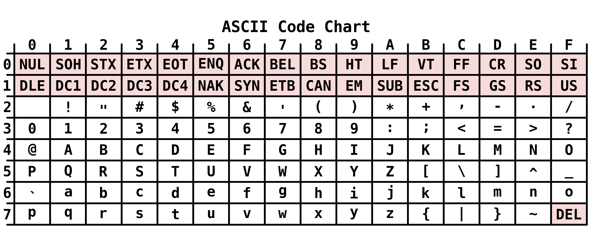

# Ints & Floats & Strings encoding

[Запись семинара](https://www.youtube.com/watch?TODO)


[Ридинг Яковлева: Целочисленная арифметика](https://github.com/victor-yacovlev/mipt-diht-caos/tree/master/practice/integers) 
<br>[Ридинг Яковлева: Вещественная арифметика](https://github.com/victor-yacovlev/mipt-diht-caos/tree/master/practice/ieee754) 


Сегодня в программе:
* <a href="#int" style="color:#856024"> Целые числа </a>
  * <a href="#ubsan" style="color:#856024"> UBSAN </a>
  * <a href="#saturation" style="color:#856024"> Насыщение </a>
* <a href="#float" style="color:#856024"> Вещественные числа </a>
* <a href="#str" style="color:#856024"> Строки </a>
  * <a href="#ascii" style="color:#856024"> ASCII </a>
  * <a href="#utf-8" style="color:#856024"> UTF-8 </a>

## <a name="int"></a> Целые числа

Производя `+`, `-`, `*` со стандартными целочисленными типами в программе мы работаем $\mathbb{Z}_{2^k}$, где $k$ - количество бит в числе. Причем это верно как со знаковыми, так и беззнаковыми числами.

В процессоре для сложения знаковых и беззнаковых чисел выполняется одна и та же инструкция.


```python
k = 3 # min 0, max 7 = (1 << 3) - 1
m = (1 << k)

def normalize(x):
    return ((x % m) + m) % m

def format_n(x):
    x = normalize(x)
    return "%du, %+d, 0b%s" % (x, x if x < (m >> 1) else x - m, bin(x + m)[3:])
    
for i in range(0, m):
    print("i=%d -> %s" % (i, format_n(i)))
```


```python
def show_add(a, b):
    print("%d + %d = %d" % (a, b, a + b))
    print("    (%s) + (%s) = (%s)" % (format_n(a), format_n(b), format_n(a + b)))
show_add(2, 1)
show_add(2, -1)
```


```python
def show_mul(a, b):
    print("%d * %d = %d" % (a, b, a * b))
    print("    (%s) * (%s) = (%s)" % (format_n(a), format_n(b), format_n(a * b)))
show_mul(2, 3)
show_mul(-2, -3)
show_mul(-1, -1)
```

Но есть некоторые тонкости. 

Если вы пишете код на C/C++ то компилятор считает **переполнение знакового типа UB** (undefined behavior). Это позволяет ему проводить оптимизации.

А переполнение беззнакового типа - законной операцией, при которой просто отбрасываются старшие биты (или значение берется по модулю $2^k$, или просто операция производится в $\mathbb{Z}_{2^k}$ - можете выбирать более удобный для вас способ на это смотреть).


```cpp
%%cpp lib.c
%run gcc -O3 -shared -fPIC lib.c -o lib.so  -Os -Wl,--gc-sections -fno-asynchronous-unwind-tables -fcf-protection=branch -mmanual-endbr 

int check_increment(int x) {
    return x + 1 > x; // Всегда ли true?
}

int unsigned_check_increment(unsigned int x) {
    return x + 1 > x; // Всегда ли true?
}
```


```python
import ctypes

int32_max = (1 << 31) - 1
uint32_max = (1 << 32) - 1

lib = ctypes.CDLL("./lib.so")
lib.check_increment.argtypes = [ctypes.c_int]
lib.unsigned_check_increment.argtypes = [ctypes.c_uint]

%p lib.check_increment(1)
%p lib.check_increment(int32_max)

%p lib.unsigned_check_increment(1)
%p lib.unsigned_check_increment(uint32_max)
```


```python
!gdb lib.so -batch -ex="disass check_increment" -ex="disass unsigned_check_increment"
```

### <a name="ubsan"></a> UBSAN


```python
# UB санитайзер в gcc этого не ловит :|
# А вот clang молодец :)
!clang -O0 -shared -fPIC -fsanitize=undefined lib.c -o lib_ubsan.so
```


```python
%%save_file run_ub.py
%run LD_PRELOAD=$(gcc -print-file-name=libubsan.so) python3 run_ub.py

import ctypes 

int32_max = (1 << 31) - 1

lib = ctypes.CDLL("./lib_ubsan.so")
lib.check_increment.argtypes = [ctypes.c_int]

print(lib.check_increment(int32_max))
```

### <a name="saturation"></a> Насыщение


```cpp
%%cpp code_sample
// воображаемая ситуация, когда переполнение нежелательно
isize = 100000
n, m = 100000
for (int i = 0; i < isize && i < saturation_multiplication(n, m); ++i) {
    
}
```

Иногда хочется обрабатывать переполнения разумным образом, например, насыщением:


```cpp
%%cpp main.c
%run gcc -O3 main.c -o a.exe 
%run ./a.exe

#include <assert.h>
#include <stdint.h>

unsigned int satsum(unsigned int x, unsigned int y) {
    unsigned int z;
    // Функция, которая обрабатывает выставленный процессором флаг и возвращает его явно
    if (__builtin_uadd_overflow(x, y, &z)) {
        return ~0u;
    }
    return z;
}

int main() {
    assert(satsum(2000000000L, 2000000000L) == 4000000000L);
    assert(satsum(4000000000L, 4000000000L) == (unsigned int)-1);
    return 0;
}
```


```python

```

Для операций сравнения и деления целых чисел уже однозначно важно, знаковые они или нет.


```cpp
%%cpp lib2.c
%run gcc -O3 -shared -fPIC lib2.c -o lib2.so   -Os -Wl,--gc-sections -fno-asynchronous-unwind-tables -fcf-protection=branch -mmanual-endbr 

typedef unsigned int uint;

int sum(int x, int y) { return x + y; }
uint usum(uint x, uint y) { return x + y; }

int mul(int x, int y) { return x * y; }
uint umul(uint x, uint y) { return x * y; }

int cmp(int x, int y) { return x < y; }
int ucmp(uint x, uint y) { return x < y; }

int div(int x, int y) { return x / y; }
int udiv(uint x, uint y) { return x / y; }
```


```python
# Функции sum и usum идентичны
!gdb lib2.so -batch -ex="disass sum" -ex="disass usum" | grep -v "End of assembler"
```


```python
!gdb lib2.so -batch -ex="disass mul" -ex="disass umul" | grep -v "End of assembler"
```


```python
# Функции cmp и ucmp отличаются!
!gdb lib2.so -batch -ex="disass cmp" -ex="disass ucmp" | grep -v "End of assembler"
```


```python
!gdb lib2.so -batch -ex="disass div" -ex="disass udiv" | grep -v "End of assembler"
```


```python

```

## <a name="size"></a> Про размеры int'ов и знаковость

<p> <details> <summary> ► Установка всякого-разного</summary>
 
Для `-m32`

`sudo apt-get install g++-multilib libc6-dev-i386`

Для `qemu-arm`

`sudo apt-get install qemu-system-arm qemu-user`

`sudo apt-get install lib32z1`

Для сборки и запуска arm:

`wget http://releases.linaro.org/components/toolchain/binaries/7.3-2018.05/arm-linux-gnueabi/gcc-linaro-7.3.1-2018.05-i686_arm-linux-gnueabi.tar.xz`

`tar xvf gcc-linaro-7.3.1-2018.05-i686_arm-linux-gnueabi.tar.xz`


</details> </p>


```python
# Add path to compilers to PATH
import os
os.environ["PATH"] = os.environ["PATH"] + ":" + \
    "/home/pechatnov/arm/gcc-linaro-7.3.1-2018.05-i686_arm-linux-gnueabi/bin"
```


```cpp
%%cpp size.c
%run gcc size.c -o size.exe && ./size.exe # Компилируем обычным образом
%run gcc -m32 size.c -o size.exe && ./size.exe # Под 32-битную архитектуру
%run arm-linux-gnueabi-gcc -marm size.c -o size.exe && qemu-arm -L ~/arm/gcc-linaro-7.3.1-2018.05-i686_arm-linux-gnueabi/arm-linux-gnueabi/libc ./size.exe # Под ARM

#include <stdio.h>

int main() {
    printf("is char signed = %d, ", (int)((char)(-1) > 0));
    printf("sizeof(long int) = %d\n", (int)sizeof(long int));
}
```

Какой из этого можно сделать вывод? Хотите понятный тип - используйте типы с детерминированым размером и знаковостью - uint64_t и другие подобные 


```python

```


```python

```

## <a name="bit"></a> Битовые операции

`^`, `|`, `&`, `~`, `>>`, `<<`


```python
a = 0b0110

def my_bin(x, digits=4):
    m = (1 << digits)
    x = ((x % m) + m) % m # Эмулируем конечное число бит в int-е в python 
    return "0b{:0{digits}b}".format(x, digits=digits)

%p my_bin(     a)  # 4-битное число
%p my_bin(    ~a)  # Его побитовое отрицание
%p my_bin(a >> 1)  # Его сдвиг вправо на 1
%p my_bin(a << 1)  # Его сдвиг влево на 1
```


```python
x = 0b0011
y = 0b1001

%p my_bin(x    )  # X
%p my_bin(y    )  # Y

%p my_bin(x | y)  # Побитовый OR
%p my_bin(x ^ y)  # Побитовый XOR
%p my_bin(x & y)  # Побитовый AND
```

Задачки:
1. Получите из числа `a` `i`-ый бит 
2. Выставьте в целом числе `a` `i`-ый бит 
3. Занулите в целом числе `a` `i`-ый бит 
4. Инвертируйте в целом числе `a` `i`-ый бит 
5. Получите биты числа `a` с `i` по `j` невключительно как беззнаковое число
6. Скопируйте в биты числа `a` с `i` по `j` невключительно младшие биты числа `b` 

<details> <summary>  ► Решения с семинара </summary>
<pre> <code> 

</code> </pre>
</details>

## <a name="float"></a> Вещественные числа

Давайте просто посмотрим на битовые представления вещественных чисел и найдем закономерности :)


```cpp
%%cpp stand.h
// Можно не вникать, просто печаталка битиков

#include <assert.h>
#include <stdbool.h>
#include <stdio.h>
#include <stdint.h>
#include <inttypes.h>
#include <string.h>

#define EXTRA_INFO // включение более подробного вывода
#if defined(EXTRA_INFO)
    #define FORMULA_TEXT "(-1)^S * 2^(E-B) * (1+M/(2^Mbits))"
    #define DENORM_FORMULA_TEXT "\n  (-1)^S * M / 2^(1023 + 51)"
    #define IS_VLINE_POINT(i) (i == 63 || i == 52)
    #define DESCRIBE(d) describe_double(d)
    #define DENORM_DESCRIBE(d) denorm_describe_double(d)
typedef union {
    double double_val;
    struct {
        uint64_t mantissa_val : 52;
        uint64_t exp_val : 11;
        uint64_t sign_val : 1;
    };
} double_parser_t;

void describe_double(double x) {
    double_parser_t parser = {.double_val = x};
    assert(parser.exp_val != 0 || x == 0.0); // ensure not denorm
    printf("  (-1)^%d * 2^(%d) * 0x1.%013llx", 
           (int)parser.sign_val, parser.exp_val - 1023, (long long unsigned int)parser.mantissa_val);
}

void denorm_describe_double(double x) {
    double_parser_t parser = {.double_val = x};
    assert(parser.exp_val == 0 && x != 0.0); // ensure denorm
    printf("\n  (-1)^%d * 0x%013llx / 2^(1023 + 51)", 
           (int)parser.sign_val, (long long unsigned int)parser.mantissa_val);
}

#else
    #define FORMULA_TEXT ""
    #define DENORM_FORMULA_TEXT ""
    #define IS_VLINE_POINT(i) 0
    #define DESCRIBE(d) (void)(d)
    #define DENORM_DESCRIBE(d) (void)(d)
#endif

inline uint64_t bits_of_double(double d) {
    uint64_t result;
    memcpy(&result, &d, sizeof(result));
    return result;
}

inline void print_doubles(double* dds, _Bool denorm) {
    char line_1[70] = {0}, line_2[70] = {0}, hline[70] = {0};
    int j = 0;
    for (int i = 63; i >= 0; --i) {
        line_1[j] = (i % 10 == 0) ? ('0' + (i / 10)) : ' ';
        line_2[j] = '0' + (i % 10);
        hline[j] = '-';
        ++j;
        if (IS_VLINE_POINT(i)) {
            line_1[j] = line_2[j] = '|';
            hline[j] = '-';
            ++j;
        }
    }
    const char* prespaces = denorm ? "              " : "";
    printf("%sBit numbers: %s\n", prespaces, line_1);
    printf("%s             %s  %s\n", prespaces, line_2, denorm ? DENORM_FORMULA_TEXT : FORMULA_TEXT);
    printf("%s             %s\n", prespaces, hline);
    for (double* d = dds; *d; ++d) {
        printf(denorm ? "%24.13la   " : "%10.4lf   ", *d);
        uint64_t m = bits_of_double(*d);
        for (int i = 63; i >= 0; --i) {
            printf("%d", (int)((m >> i) & 1));
            if (IS_VLINE_POINT(i)) {
                printf("|");
            }
        }
        denorm ? DENORM_DESCRIBE(*d) : DESCRIBE(*d);
        printf("\n");
    }
}
```

##### Посмотрим на пары чисел x и -x


```cpp
%%cpp stand.cpp
%run gcc stand.cpp -o stand.exe
%run ./stand.exe

#include "stand.h"

int main() {
    double dd[] = {1, -1, 132, -132, 3.1415, -3.1415,  0};
    print_doubles(dd, /*denorm = */ false);
}
```

##### Посмотрим на степени 2-ки


```cpp
%%cpp stand.cpp
%run gcc stand.cpp -o stand.exe
%run ./stand.exe

#include "stand.h"

int main() {
    double dd[] = {0.125, 0.25, 0.5, 1, 2, 4, 8, 16, 0};
    print_doubles(dd, /*denorm = */ false);
}
```

##### Посмотрим на числа вида $ 1 + i \cdot 2^{(-k)}$


```cpp
%%cpp stand.cpp
%run gcc stand.cpp -o stand.exe
%run ./stand.exe

#include "stand.h"

int main() {
    double t8 = 1.0 / 8;
    double dd[] = {1 + 0 * t8, 1 + 1 * t8, 1 + 2 * t8, 1 + 3 * t8, 1 + 4 * t8, 
                   1 + 5 * t8, 1 + 6 * t8, 1 + 7 * t8, 0};
    print_doubles(dd, /*denorm = */ false);
}
```

##### Посмотрим на числа вида $ 1 + i \cdot 2^{(-k)}$


```cpp
%%cpp stand.cpp
%run gcc stand.cpp -o stand.exe
%run ./stand.exe

#include "stand.h"

int main() {
    double eps = 1.0 / (1LL << 52);
    double dd[] = {1 + 0 * eps, 1 + 1 * eps, 1 + 2 * eps, 1 + 3 * eps, 1 + 4 * eps, 0};
    print_doubles(dd, /*denorm = */ false);
}
```

##### Денормализованные числа


```cpp
%%cpp stand.cpp
%run gcc stand.cpp -o stand.exe
%run ./stand.exe

#include <math.h>
#include "stand.h"

int main() {
    double dd[] = {-1. / pow(2, 1023) / 1, 1. / pow(2, 1023) / 2, 1. / pow(2, 1023) / pow(2, 50), 1. / pow(2, 1023) / pow(2, 51), 0};
    print_doubles(dd, /*denorm = */ true);
}
```

##### Посмотрим на существенно разные значения double


```cpp
%%cpp stand.cpp
%run gcc stand.cpp -o stand.exe
%run ./stand.exe

#include <math.h>
#include "stand.h"

int main() {
    double dd[] = {0.1, 1.5, 100, NAN, -NAN, 0.0 / 0.0, INFINITY, -INFINITY, 0};
    print_doubles(dd, /*denorm = */ false);
}
```

А зачем нужен -nan?

Я надеюсь по примерам вы уловили суть. Подробнее за теорией можно в 
[Ридинг Яковлева: Вещественная арифметика](https://github.com/victor-yacovlev/mipt-diht-caos/tree/master/practice/ieee754) 


```python

```


```python

```

# Дополнение про bitcast


```cpp
%%cpp bitcast.c
%run gcc -O2 -Wall bitcast.c -o bitcast.exe  -Os -fno-asynchronous-unwind-tables -fcf-protection=branch -mmanual-endbr 
%run ./bitcast.exe

#include <stdio.h>
#include <string.h>
#include <stdint.h>
#include <inttypes.h>

uint64_t bit_cast_memcpy(double d) {
    uint64_t result;
    memcpy(&result, &d, sizeof(result)); // Железобетонный способ, но чуть сложнее для оптимизатора
    return result;
}

typedef union {
    double double_val;
    uint64_t ui64_val;
} converter_t;

uint64_t bit_cast_union(double d) {
    converter_t conv;
    conv.double_val = d;
    return conv.ui64_val;
    //return ((converter_t){.double_val = d}).ui64_val; // Вроде (?) хорошее решение
}

uint64_t bit_cast_ptr(double d) {
    return *(uint64_t*)(void*)&d; // Простое, но неоднозначное решение из-за алиасинга
}

int main() {
    double d = 3.15;
    printf("%" PRId64 "\n", bit_cast_memcpy(d));
    printf("%" PRId64 "\n", bit_cast_union(d));
    printf("%" PRId64 "\n", bit_cast_memcpy(d));
}
```


```python
# Все способы одинаково эффективны при компиляции с -O2
!gdb bitcast.exe -batch -ex="disass bit_cast_memcpy" -ex="disass bit_cast_union" -ex="disass bit_cast_ptr"
```

Я бы рекомендовал использовать в таких случаях memcpy. [Так сделано в std::bit_cast](https://en.cppreference.com/w/cpp/numeric/bit_cast)

[Про C++ алиасинг, ловкие оптимизации и подлые баги / Хабр](https://habr.com/ru/post/114117/)


```python

```


## <a name="str"></a> Строки


`pip3 install --user hexdump` - установить.


```python
print("Привет, мир! - Перевод на эльфийский.".encode("cp1251").decode("cp1252"))
```


```python

```


```python
from hexdump import hexdump
```

### <a name="ascii"></a> ASCII

TLDR: ASCII - половина 8-битной кодировки. 

То есть на самом деле есть целое семейство 8-битных кодировок (например, KOI-8), у которых первые 128 символов - ASCII. 

В ASCII входят десятичные цифры, латинцский алфавит, знаки препинания, ... смотрите картинку




```python
hexdump("AABBCC__112233".encode("ascii"))
hexdump("Hello!".encode("ascii"))
```


```python
hexdump("Я вижу вас".encode("ascii"))
```

Про KOI-8


```python
hexdump("AABBCC__112233".encode("koi8-r"))
hexdump("ЯЯООЁЁ__ЬЬУУЗЗ".encode("koi8-r"))
hexdump("Я вижу вас".encode("koi8-r"))

```

### <a name="utf-8"></a> UTF-8

UTF-8 - кодировка для Unicode.

TLDR: Unicode - пронумерованное множество символов (как единиц смысла, а не глифов) + семейство кодировок UTF


```python
hexdump("AABBCC__112233".encode("ascii"))
hexdump("AABBCC__112233".encode("utf-8"))
```


```python
hexdump("ЯЯООЁЁ__ЬЬУУЗЗ".encode("koi8-r"))
print()
hexdump("ЯЯООЁЁ__ЬЬУУЗЗ".encode("utf-8"))
```


```python


```


```python
def add_spaces(s):
    return "".join(c + ("" if (i + 1) % 6 else " ") for i, c in enumerate(s[::-1]))[::-1]

def show_utf_8(c):
    num = c if isinstance(c, int) else ord(c) 
    print("       CHR:", chr(num))
    encoded = chr(num).encode("utf-8")
    print("   BIN NUM: {:b}".format(num))
    print("  BIN NUM2:", add_spaces("{:b}".format(num)))
    print(" UTF-8 BIN:", " ".join("{:b}".format(b) for b in encoded))

show_utf_8("😊")
show_utf_8("Ш")
show_utf_8("0")
```


```python
print(chr(0x0418) + chr(0x0306))
print(chr(0x0418) + " " + chr(0x0306))
```

&#x0418;&#x0306;


```python

```


```python

```
