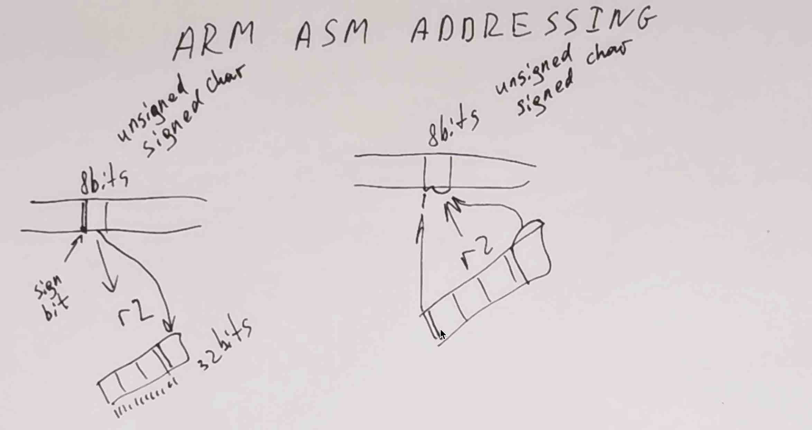

# ARM ASM ADDRESSING

<table width=100%> <tr>
    <th width=20%> <b>Видеозапись семинара &rarr; </b> </th>
    <th>
    <a href="https://www.youtube.com/watch?v=V1Dc6ESqW6E&list=PLjzMm8llUm4AmU6i_hPU0NobgA4VsBowc&index=7">
         
    </a>
    </th>
    <th> </th>
 </table>

[Ридинг Яковлева: Адресация данных в памяти и использование библиотечных функций](https://github.com/victor-yacovlev/mipt-diht-caos/tree/master/practice/arm_globals_plt)

Сегодня в программе:
* <a href="#array" style="color:#856024"> Пример работы с массивом из ассемблера </a>
* <a href="#ldr_str" style="color:#856024">  Разные варианты STR, LDR </a>
* <a href="#placement" style="color:#856024"> Размещение структур в памяти </a>
* <a href="#byte" style="color:#856024">  Загрузка и сохранение в память 1/2/4/8 байтных целых чисел </a>
* <a href="#basnya" style="color:#856024"> Басня от jungletryne </a>


```python

```


```python
import os

linaro_download_dir = os.path.expanduser("~/arm/gcc-linaro-7.3.1-2018.05-i686_arm-linux-gnueabi")

gcc_linaro_path = os.path.join(linaro_download_dir, "bin")
if gcc_linaro_path not in os.environ["PATH"]:
    os.environ["PATH"] += ":" + gcc_linaro_path

os.environ["QEMU_LD_PREFIX"] = os.path.join(linaro_download_dir, "arm-linux-gnueabi/libc")    
```

# <a name="array"></a> Пример работы с массивом из ассемблера


```cpp
%%cpp lib.c
%run arm-linux-gnueabi-gcc -c -Os -fno-asynchronous-unwind-tables -marm lib.c -o lib.o
%run arm-linux-gnueabi-objdump -D lib.o | grep '<sum_v>' -A 14

int sum_v(int* a, int* b, int n) {
    for (int i = 0; i < n; ++i) {
        a[i] += b[i];
    }
}

int sum_v_2(int* a, int* b, int n) {
    for (int* a_end = a + n; a != a_end; ++a, ++b) {
        *a += *b;
    }
}
```


Run: `arm-linux-gnueabi-gcc -c -Os -fno-asynchronous-unwind-tables -marm lib.c -o lib.o`


Run: `arm-linux-gnueabi-objdump -D lib.o | grep '<sum_v>' -A 14`


    00000000 <sum_v>:
       0:	e3a03000 	mov	r3, #0
       4:	e1530002 	cmp	r3, r2
       8:	ba000000 	blt	10 <sum_v+0x10>
       c:	e12fff1e 	bx	lr
      10:	e52de004 	push	{lr}		; (str lr, [sp, #-4]!)
      14:	e790c103 	ldr	ip, [r0, r3, lsl #2]
      18:	e791e103 	ldr	lr, [r1, r3, lsl #2]
      1c:	e08cc00e 	add	ip, ip, lr
      20:	e780c103 	str	ip, [r0, r3, lsl #2]
      24:	e2833001 	add	r3, r3, #1
      28:	e1530002 	cmp	r3, r2
      2c:	bafffff8 	blt	14 <sum_v+0x14>
      30:	e49df004 	pop	{pc}		; (ldr pc, [sp], #4)
    


```cpp
%%cpp test_sum_v.c
%run arm-linux-gnueabi-gcc -marm -fsanitize=address lib.c test_sum_v.c -o test_sum_v.exe
%run qemu-arm ./test_sum_v.exe

#include <stdio.h>
#include <assert.h>

int sum_v(int* a, int* b, int n);

void test() {
    {
        int a[] = {1, 2, 3};
        int b[] = {10, 20, 30};
        sum_v(a, b, 3);
        assert(a[0] == 11);
        assert(a[1] == 22);
        assert(a[2] == 33);
    }
    {
        int a[] = {};
        int b[] = {};
        sum_v(a, b, 0);    
    }
    printf("SUCCESS\n");
}

int main() {
    test();
}
```


Run: `arm-linux-gnueabi-gcc -marm -fsanitize=address lib.c test_sum_v.c -o test_sum_v.exe`


Run: `qemu-arm ./test_sum_v.exe`


    SUCCESS


### Вариант 1: причесанный дизассемблер


```cpp
%%cpp lib.S
%run arm-linux-gnueabi-gcc -marm -fsanitize=address lib.S test_sum_v.c -o test_sum_v.exe
%run qemu-arm ./test_sum_v.exe

.global sum_v
sum_v:
    mov r3, #0
    cmp r3, r2
    blt long_path // if (else block)
        bx lr
    long_path:    // if (first block)
        push {lr}
        while_do: // do
            ldr ip, [r0, r3, lsl #2] // C-style: ip = *(r0 + (r3 << 2))
            ldr lr, [r1, r3, lsl #2]
            add ip, ip, lr
            str ip, [r0, r3, lsl #2] // C-style: *(r0 + (r3 << 2)) = ip
            add r3, r3, #1
            cmp r3, r2
            blt while_do // while (i < n)
        pop {pc}
```


Run: `arm-linux-gnueabi-gcc -marm -fsanitize=address lib.S test_sum_v.c -o test_sum_v.exe`


Run: `qemu-arm ./test_sum_v.exe`


    SUCCESS


### Вариант 2: c нуля, придерживаясь сишной структуры кода


```cpp
%%cpp lib.S
%run arm-linux-gnueabi-gcc -marm -fsanitize=address lib.S test_sum_v.c -o test_sum_v.exe
%run qemu-arm ./test_sum_v.exe

.global sum_v
sum_v:
    // C-style: r0 = a, r1 = b, r2 = n
    add r2, r0, r2, lsl #2 // C-style: r2 = (a + n * 4)
    while_start: // while
        cmp r0, r2
        beq while_end
            ldr ip, [r0] // C-style: ip = *r0
            ldr r3, [r1] // C-style: r3 = *r1
            add r3, r3, ip // C-style: r3 += ip
            str r3, [r0] // C-style: *r0 = r3
            add r0, r0, #4
            add r1, r1, #4
        b while_start
    while_end: // while end
    bx lr
```


Run: `arm-linux-gnueabi-gcc -marm -fsanitize=address lib.S test_sum_v.c -o test_sum_v.exe`


Run: `qemu-arm ./test_sum_v.exe`


    SUCCESS


### Вариант 3: оптимизируем


```cpp
%%cpp lib.S
%run arm-linux-gnueabi-gcc -marm -fsanitize=address lib.S test_sum_v.c -o test_sum_v.exe
%run qemu-arm ./test_sum_v.exe

.global sum_v
sum_v:
    // C-style: r0 = a, r1 = b, r2 = n
    add r2, r0, r2, lsl #2 // C-style: r2 = r0 + (r2 << 2)
    while_start: // while
        cmp r0, r2
        beq while_end
            ldr ip, [r0] // C-style: ip = *r0
            ldr r3, [r1], #4 // C-style: r3 = *r1, r1 += 4
            add r3, r3, ip // C-style: r3 += ip
            str r3, [r0], #4 // C-style: *r0 = r3, r0 += 4
        b while_start
    while_end: // while end
    bx lr
```


Run: `arm-linux-gnueabi-gcc -marm -fsanitize=address lib.S test_sum_v.c -o test_sum_v.exe`


Run: `qemu-arm ./test_sum_v.exe`


    SUCCESS


# <a name="ldr_str"></a> Разные варианты STR, LDR:


```cpp
%%cpp program_asm_p.c
%run arm-linux-gnueabi-gcc -marm program_asm_p.c -o program.exe
%run qemu-arm ./program.exe ; echo 

#include <stdio.h>
#include <assert.h>

int* load_1(int* a, int* b, int n);
__asm__ (R"(
.global load_1
load_1:
    ldr r3, [r0] // r3 = *r0
    str r3, [r1] // *b = r3
    bx lr
)");

int* load_2(int* a, int* b, int n);
__asm__ (R"(
.global load_2
load_2:
    ldr r3, [r0, r2, lsl #2] // r3 = *(r0 + (r2 << 2))
    str r3, [r1] // *b = r3
    bx lr
)");

int* load_3(int* a, int* b, int n);
__asm__ (R"(
.global load_3
load_3:
    ldr r3, [r0, r2, lsl #2]! // r0 += (r2 << 2); r3 = *r0
    str r3, [r1] // *b = r3
    bx lr
)");

int* load_4(int* a, int* b, int n);
__asm__ (R"(
.global load_4
load_4:
    ldr r3, [r0], r2, lsl #2 // r3 = *r0; r0 += (r2 << 2)
    str r3, [r1] // *b = r3
    bx lr
)");


int main() {
    int a[] = {10, 20, 30};
    int res;
    
    // Просто загрузить
    // ldr r3, [r0]
    assert(load_1(a, &res, 0) == a);
    assert(res == 10);
    
    // Загрузить по адресу со смещением
    // ldr r3, [r0, r2, lsl #2]
    assert(load_2(a, &res, 0) == a);
    assert(res == 10);
    assert(load_2(a, &res, 1) == a);
    assert(res == 20);
    
    // Загрузить по префикс-инкрементнутому адресу
    // ldr r3, [r0, r2, lsl #2]!
    assert(load_3(a, &res, 0) == a);
    assert(res == 10);
    assert(load_3(a, &res, 1) == a + 1); // (!)
    assert(res == 20);
    
    // Загрузить по постфикс-инкрементнутому адресу
    // ldr r3, [r0], r2, lsl #2
    assert(load_4(a, &res, 0) == a);
    assert(res == 10);
    assert(load_4(a, &res, 1) == a + 1); // (!)
    assert(res == 10); // (!)
        
    printf("SUCCESS\n");
    
    return 0;
}

```


Run: `arm-linux-gnueabi-gcc -marm program_asm_p.c -o program.exe`


Run: `qemu-arm ./program.exe ; echo`


    SUCCESS
    


```python

```

# <a name="placement"></a> Размещение структур в памяти

Не все всегда расположено очевидным образом: для более эффективного выполнения программы бывает выгодно выровненное расположение объектов в памяти, например считывать ui64 из памяти выгоднее, если адрес делится на 8.

Примерные правила:
* выравнивание (то, на что адрес должен делиться) равно размеру для простых арифметических типов (указатели тоже здесь)
* в union берется максимум для выравнивания (и максимум из размеров округенный вверх, чтобы делиться на выравнивание)
* в struct члены располагаются в том порядке, в котором указаны. Выравнивание структуры - максимум выравниваний. Каждый член располагается так, чтобы удовлетворять собственному выравниванию. Итоговый размер структуры делится на выравнивание структуры. С учетом этого размер струкуры минимизируется.

Для экспериментов можно использовать `sizeof()` и `_Alignof()`, чтобы получить размер и выравнивание.


```cpp
%%cpp structs_in_memory_common.h

#include <stdio.h>
#include <stdint.h>
#include <assert.h>

#define print_int(x) printf(#x " = %d\n", (int)x)

#define print_info(x) printf("%10s: size = %d, alignment = %d\n", #x, sizeof(x), _Alignof(x))

#define print_offset(type, field) {\
    type o; \
    printf("  %10s: shift of ." #field " is %d\n", #type, (int)((void*)&o.field - (void*)&o)); \
}
```


```cpp
%%cpp structs_in_memory.c
%run arm-linux-gnueabi-gcc -marm structs_in_memory.c -o structs_in_memory.exe
%run qemu-arm ./structs_in_memory.exe

#include "structs_in_memory_common.h"

int main() {
    print_info(char);
    print_info(short);
    print_info(int);
    print_info(long long);
    print_info(double); 
    return 0;
}
```


Run: `arm-linux-gnueabi-gcc -marm structs_in_memory.c -o structs_in_memory.exe`


Run: `qemu-arm ./structs_in_memory.exe`


          char: size = 1, alignment = 1
         short: size = 2, alignment = 2
           int: size = 4, alignment = 4
     long long: size = 8, alignment = 8
        double: size = 8, alignment = 8


```cpp
%%cpp structs_in_memory.c
%run arm-linux-gnueabi-gcc -marm structs_in_memory.c -o structs_in_memory.exe
%run qemu-arm ./structs_in_memory.exe

#include "structs_in_memory_common.h"

int main() {
    typedef struct { // максимальное выравнивание у инта, значит выравнивание структуры 4
        char c;      // 0 байт
        int i;       // 4-7 байты
        char c2;     // 8 байт
    } Obj1_t;        // 9-11 - padding байты, чтобы размер делился на выравнивание
    print_info(Obj1_t);
    print_offset(Obj1_t, c);
    print_offset(Obj1_t, i);
    print_offset(Obj1_t, c2);
    
    typedef struct { // тут все правила про выравнивание не применимы, так как указан аттрибут упаковки
        char c;
        int i;
        char c2;
    } __attribute__((packed)) Obj2_t;
    print_info(Obj2_t);
    print_offset(Obj2_t, c);
    print_offset(Obj2_t, i);
    print_offset(Obj2_t, c2);
    
    return 0;
}
```


Run: `arm-linux-gnueabi-gcc -marm structs_in_memory.c -o structs_in_memory.exe`


Run: `qemu-arm ./structs_in_memory.exe`


        Obj1_t: size = 12, alignment = 4
          Obj1_t: shift of .c is 0
          Obj1_t: shift of .i is 4
          Obj1_t: shift of .c2 is 8
        Obj2_t: size = 6, alignment = 1
          Obj2_t: shift of .c is 0
          Obj2_t: shift of .i is 1
          Obj2_t: shift of .c2 is 5


```cpp
%%cpp structs_in_memory.c
%run arm-linux-gnueabi-gcc -marm structs_in_memory.c -o structs_in_memory.exe
%run qemu-arm ./structs_in_memory.exe

#include "structs_in_memory_common.h"

int main() {
    
    typedef struct {  // максимальное выравнивание члена - 8, так что и у всей структуры такое же
        char c8;      // 0 байт 
        uint64_t u64; // 8-15 байты
    } Obj3_t;         // всего 16 байт, выравнивание 8
    print_info(Obj3_t);
    print_offset(Obj3_t, c8);
    print_offset(Obj3_t, u64);
    
    
    typedef struct {
        char c8;
        char c8_1;
        char c8_2;
    } Obj4_t;
    print_info(Obj4_t);
    print_offset(Obj4_t, c8);
    print_offset(Obj4_t, c8_1);
    print_offset(Obj4_t, c8_2);
    
    return 0;
}
```


Run: `arm-linux-gnueabi-gcc -marm structs_in_memory.c -o structs_in_memory.exe`


Run: `qemu-arm ./structs_in_memory.exe`


        Obj3_t: size = 16, alignment = 8
          Obj3_t: shift of .c8 is 0
          Obj3_t: shift of .u64 is 8
        Obj4_t: size = 3, alignment = 1
          Obj4_t: shift of .c8 is 0
          Obj4_t: shift of .c8_1 is 1
          Obj4_t: shift of .c8_2 is 2


```cpp
%%cpp structs_in_memory.c
%run arm-linux-gnueabi-gcc -marm structs_in_memory.c -o structs_in_memory.exe
%run qemu-arm ./structs_in_memory.exe

#include "structs_in_memory_common.h"

int main() {  
    typedef struct {     // тут пример двух структур равного размера, но с разным выравниванием
        long long a;
    } ObjS8A8;
    print_info(ObjS8A8);
    typedef struct {
        int a;
        int b;
    } ObjS8A4;
    print_info(ObjS8A4);
    
    typedef struct {    // и вот тут разное выравнивание ObjS8A8 и ObjS8A4 себя покажет
        ObjS8A8 o;
        char c;
    } Obj5_t;    
    print_info(Obj5_t); // обратите внимание на разницу с Obj6_t!

    typedef struct {
        ObjS8A4 o;
        char c;
    } Obj6_t;
    print_info(Obj6_t);
    
    typedef union {
        unsigned long long u;
        int i[3];
    } Obj7_t;
    print_info(Obj7_t); // то же самое, что и с Obj5_t
    
    return 0;
}
```


Run: `arm-linux-gnueabi-gcc -marm structs_in_memory.c -o structs_in_memory.exe`


Run: `qemu-arm ./structs_in_memory.exe`


       ObjS8A8: size = 8, alignment = 8
       ObjS8A4: size = 8, alignment = 4
        Obj5_t: size = 16, alignment = 8
        Obj6_t: size = 12, alignment = 4
        Obj7_t: size = 16, alignment = 8


```python

```


```python

```


```python

```


```python

```

## <a name="byte"></a> Загрузка и сохранение в память 1/2/4/8 байтных целых чисел


```cpp
%%cpp lib.c
%run arm-linux-gnueabi-gcc -S -Os -fno-asynchronous-unwind-tables -marm lib.c -o /dev/stdout

#include <stdint.h>

typedef struct {
    uint8_t u8;
    uint16_t u16;
    uint32_t u32;
    uint64_t u64;
}  __attribute__((packed)) complicated_t;    
    
    
void parse(complicated_t* a, uint8_t* du8, uint16_t* du16, uint32_t* du32, uint64_t* du64) {
    *du8 = a->u8;
    *du16 = a->u16;
    *du32 = a->u32;
    *du64 = a->u64;
}

```


Run: `arm-linux-gnueabi-gcc -S -Os -fno-asynchronous-unwind-tables -marm lib.c -o /dev/stdout`


    	.arch armv7-a
    	.eabi_attribute 20, 1
    	.eabi_attribute 21, 1
    	.eabi_attribute 23, 3
    	.eabi_attribute 24, 1
    	.eabi_attribute 25, 1
    	.eabi_attribute 26, 2
    	.eabi_attribute 30, 4
    	.eabi_attribute 34, 1
    	.eabi_attribute 18, 4
    	.file	"lib.c"
    	.text
    	.align	2
    	.global	parse
    	.syntax unified
    	.arm
    	.fpu softvfp
    	.type	parse, %function
    parse:
    	@ args = 4, pretend = 0, frame = 0
    	@ frame_needed = 0, uses_anonymous_args = 0
    	str	lr, [sp, #-4]!
    	ldrb	lr, [r0]	@ zero_extendqisi2
    	ldr	ip, [sp, #4]
    	strb	lr, [r1]
    	ldrh	r1, [r0, #1]	@ unaligned
    	strh	r1, [r2]	@ movhi
    	ldr	r2, [r0, #3]	@ unaligned
    	str	r2, [r3]
    	ldr	r2, [r0, #7]	@ unaligned
    	ldr	r3, [r0, #11]	@ unaligned
    	strd	r2, [ip]
    	ldr	pc, [sp], #4
    	.size	parse, .-parse
    	.ident	"GCC: (Linaro GCC 7.3-2018.05) 7.3.1 20180425 [linaro-7.3-2018.05 revision d29120a424ecfbc167ef90065c0eeb7f91977701]"
    	.section	.note.GNU-stack,"",%progbits


```cpp
%%cpp lib.c
%run arm-linux-gnueabi-gcc -S -Os -fno-asynchronous-unwind-tables -marm lib.c -o /dev/stdout

#include <stdint.h>

typedef struct {
    int8_t i8;
    int16_t i16;
    int32_t i32;
    int64_t i64;
} __attribute__((packed)) complicated_t;    
    
    
int parse(complicated_t* a, int8_t* di8, int16_t* di16, int32_t* di32, int64_t* di64) {
    *di8 = a->i8;
    *di16 = a->i16;
    *di32 = a->i32;
    *di64 = a->i64;
}

```


Run: `arm-linux-gnueabi-gcc -S -Os -fno-asynchronous-unwind-tables -marm lib.c -o /dev/stdout`


    	.arch armv7-a
    	.eabi_attribute 20, 1
    	.eabi_attribute 21, 1
    	.eabi_attribute 23, 3
    	.eabi_attribute 24, 1
    	.eabi_attribute 25, 1
    	.eabi_attribute 26, 2
    	.eabi_attribute 30, 4
    	.eabi_attribute 34, 1
    	.eabi_attribute 18, 4
    	.file	"lib.c"
    	.text
    	.align	2
    	.global	parse
    	.syntax unified
    	.arm
    	.fpu softvfp
    	.type	parse, %function
    parse:
    	@ args = 4, pretend = 0, frame = 0
    	@ frame_needed = 0, uses_anonymous_args = 0
    	str	lr, [sp, #-4]!
    	ldrsb	lr, [r0]
    	ldr	ip, [sp, #4]
    	strb	lr, [r1]
    	ldrsh	r1, [r0, #1]	@ unaligned
    	strh	r1, [r2]	@ movhi
    	ldr	r2, [r0, #3]	@ unaligned
    	str	r2, [r3]
    	ldr	r2, [r0, #7]	@ unaligned
    	ldr	r3, [r0, #11]	@ unaligned
    	strd	r2, [ip]
    	ldr	pc, [sp], #4
    	.size	parse, .-parse
    	.ident	"GCC: (Linaro GCC 7.3-2018.05) 7.3.1 20180425 [linaro-7.3-2018.05 revision d29120a424ecfbc167ef90065c0eeb7f91977701]"
    	.section	.note.GNU-stack,"",%progbits


**Наблюдение:** в знаковом и беззнаковом случаях для сохранения используется одна и та же команда. А для загрузки разная.

```
    str	lr, [sp, #-4]!
	ldrb	lr, [r0]	@ zero_extendqisi2
	ldr	ip, [sp, #4]
	strb	lr, [r1]
	ldrh	r1, [r0, #1]	@ unaligned
	strh	r1, [r2]	@ movhi
	ldr	r2, [r0, #3]	@ unaligned
	str	r2, [r3]
	ldr	r2, [r0, #7]	@ unaligned
	ldr	r3, [r0, #11]	@ unaligned
	strd	r2, [ip]
	ldr	pc, [sp], #4
```
```
	str	lr, [sp, #-4]!
	ldrsb	lr, [r0]
	ldr	ip, [sp, #4]
	strb	lr, [r1]
	ldrsh	r1, [r0, #1]	@ unaligned
	strh	r1, [r2]	@ movhi
	ldr	r2, [r0, #3]	@ unaligned
	str	r2, [r3]
	ldr	r2, [r0, #7]	@ unaligned
	ldr	r3, [r0, #11]	@ unaligned
	strd	r2, [ip]
	ldr	pc, [sp], #4
```

### Поэлементный минимум полей нетривиальной структуры.


```cpp
%%cpp program_asm_p.c
%run arm-linux-gnueabi-gcc -marm program_asm_p.c -o program.exe
%run qemu-arm ./program.exe ; echo 

#include <stdio.h>
#include <stdint.h>
#include <assert.h>


typedef struct {
    int8_t i8;
    int16_t i16;
} __attribute__((packed)) complicated_t;    
    
    
#define min(a, b) ((a) < (b) ? (a) : (b))

#ifdef C_MIN_IMPL
void complicated_min(complicated_t* a, complicated_t* b, complicated_t* c) {
    *c = (complicated_t){.i8 = min(a->i8, b->i8), .i16 = min(a->i16, b->i16)};
}
#else
void complicated_min(complicated_t* a, complicated_t* b, complicated_t* c);
__asm__ (R"(
.global complicated_min
complicated_min:
    // r0 = a, r1 = b, r2 = c
    ldrsb r3, [r0] // r3 = a->i8
    ldrsb ip, [r1] // ip = b->i8
    cmp r3, ip     // r3 ? ip
    movgt r3, ip   // if (r3 > ip) { r3 = ip }
    strb r3, [r2]  // c->i8 = r3
    
    ldrsh r3, [r0, #1] // r3 = a->i16
    ldrsh ip, [r1, #1] // ip = b->i16
    cmp r3, ip         // r3 ? ip
    movgt r3, ip       // if (r3 > ip) { r3 = ip }
    strh r3, [r2, #1]  // c->i16 = r3
    
    bx lr // return
)");
#endif

void test() {
    complicated_t a = {0}, b = {0}, c = {0};
    
    complicated_min(&a, &b, &c);
    assert(c.i8 == 0 && c.i16 == 0);
    
    a = (complicated_t){.i8 = -3, .i16 = -4};
    complicated_min(&a, &b, &c);
    assert(c.i8 == -3 && c.i16 == -4);
    
    b = (complicated_t){.i8 = -9, .i16 = 9};
    complicated_min(&a, &b, &c);
    assert(c.i8 == -9 && c.i16 == -4);
    
    b = (complicated_t){.i8 = 9, .i16 = -9};
    complicated_min(&a, &b, &c);
    assert(c.i8 == -3 && c.i16 == -9);
    
    printf("SUCCESS\n");
}

int main() {
    test();
    return 0;
}

```


Run: `arm-linux-gnueabi-gcc -marm program_asm_p.c -o program.exe`


Run: `qemu-arm ./program.exe ; echo`


    SUCCESS
    


```python
!whereis arm-linux-gnueabi-gcc
```

    arm-linux-gnueabi-gcc: /home/pechatnov/arm/gcc-linaro-7.3.1-2018.05-i686_arm-linux-gnueabi/bin/arm-linux-gnueabi-gcc


```python
!stat `whereis arm-linux-gnueabi-gcc`
```

    stat: cannot stat 'arm-linux-gnueabi-gcc:': No such file or directory
      File: /home/pechatnov/arm/gcc-linaro-7.3.1-2018.05-i686_arm-linux-gnueabi/bin/arm-linux-gnueabi-gcc
      Size: 921324    	Blocks: 1800       IO Block: 4096   regular file
    Device: 805h/2053d	Inode: 5641900     Links: 1
    Access: (0755/-rwxr-xr-x)  Uid: ( 1000/pechatnov)   Gid: ( 1000/pechatnov)
    Access: 2020-10-07 22:43:45.984295718 +0300
    Modify: 2018-06-12 23:11:39.000000000 +0300
    Change: 2020-09-19 20:08:59.141181963 +0300
     Birth: -


```python

```

# <a name="basnya"></a> Басня от [jungletryne](https://github.com/jungletryne)

> Никто и никогда не понуждает знать. Знать просто следует, вот и
всё. Даже если рискуешь понять неправильно.
У. Эко, Имя розы

### Дисклеймер
Это не гайд про то, как решать эту задачу (asm-arm/basics/globalvars), это гайд про так, как подойти к решению данной задачи и как более менее просто найти ошибку.

### Про global 
Все началось с ошибки компиляции:
```unknown
	.text
	.extern A
	.extern B
	.extern C
	.extern D

	.global R
	.RAddr:
		.word R

	.global calculate
calculate:
	ldr r0, =A
	ldr r1, =B
	//...

	ldr r1, .RAddr
	str r0, [r1]
```
```unknown
/var/tmp/ccRyi7Xt.o: In function `main':
main.c:(.text+0x14): undefined reference to `R'
main.c:(.text+0x18): undefined reference to `R'
/var/tmp/cc7dJgwb.o: In function `.RAddr':
(.text+0x0): undefined reference to `R'
collect2: error: ld returned 1 exit status
```


И тут возник вопрос, а как обращаться к глобальным переменным из внешнего файла компиляции и из внутреннего файла компиляции.

Из внешнего файла компиляции нужно брать глобальные переменные напрямую, без предварительной обработки в виде объявления *global*. Ведь во время того, как линковщик будет выполнять свою работу, он как раз сможет эти все переменные найти, поэтому бояться не надо того, что можно к ним обращаться по имени, которое вы не объявили в ассемблерном коде.

Пример:
```
sum_global_vars:
	ldr r0, =FIRST_EXTERNAL_GLOBAL //берем адрес первой глоб. переменной
	ldr r1, =SECOND_EXTERNAL_GLOBAL //второй
	
	ldr r0, [r0] //смотрим, что по адресу
	ldr r1, [r1] //тут тоже
	sum r0, r0, r1 //складываем
	bx lr
```
Никакие *global* и *extern* до функции писать не нужно.

А вот то, что действительно стоит обработать, так это глобальные переменные в текущем модуле компиляции.

Во первых, стоит обеспечить видимость глобальной переменной
```
	.global R
```
А также, вообще говоря, объявить ее
```
	.global R
R:
	.word 0
```

Вышеприведенный код равносилен
```C
uint32_t R = 0;
```
Все, ее можно использовать. Но есть одна проблема, которую не совсем удалось осветить. У меня на локальном компьютере все работало замечательно, при этом в ejudge ловил WA по причине segfault (да, WA и segfault). Было непонятно, что вообще делать. (Можно тут было почитать документацию и найти про .text, .data, ...)

### Что же делать?

В таких ситуациях помогает классная тактика помощь ~~зала~~ компилятора. Давайте напишем эквивалентный код и скомпилируем его:
```C
extern uint32_t R = 0;
int calculate() {
	R = A*B + C*D;
}
```
Выхлоп:

```unknown
	.arch armv7-a
	.eabi_attribute 20, 1
	//... 
	.text
	.align	2
	.global	calculate
	.syntax unified
	.arm
	.fpu softvfp
	.type	calculate, %function
calculate:
	@ args = 0, pretend = 0, frame = 0
	@ frame_needed = 0, uses_anonymous_args = 0
	@ link register save eliminated.
	ldr	r2, .L2
	ldr	r3, .L2+4
	// ...
	ldr	r2, .L2+16
	str	r3, [r2]
	bx	lr
.L3:
	.align	2
.L2:
	.word	B
	.word	A
	.word	C
	.word	D
	.word	R
	.size	calculate, .-calculate
	.comm	R,4,4
	.ident	"GCC: (Linaro GCC 7.3-2018.05) 7.3.1 20180425 [linaro-7.3-2018.05 revision d29120a424ecfbc167ef90065c0eeb7f91977701]"
	.section	.note.GNU-stack,"",%progbits
```
Ууух, много ненужных секций. Смело их уберем.
```
calculate:
	ldr	r2, .L2
	//...
	ldr	r2, .L2+16
	str	r3, [r2]
	bx	lr
.L2:
	.word	B
	.word	A
	.word	C
	.word	D
	.word	R
	.comm	R,4,4
```
Про уборку: убираем все по интуиции, разумеется. Небольшими частями, чтобы если что-то сломается, знать где искать. Моя интуиция подсказывала, что все очевидные метаданные точно можно убрать, а также можно убрать то, что не содержит нужных нам имен (например, метка L3).

Метод calculate нас не интересует, мы сами могли его написать (ключевое слово - **сами**). Нас интересует то, как компилятор организовал хранение переменных. Но этом все запихнул под копот метки *L2*, причем под *R4* написал интересную команду *comm*.

Опытным путем убеждаемся, что .word для A,B,C,D,R можно убрать из под метки *L2*, а также L2, L2+4, L2+8, L2+12, L2+16 заменить на =A, =B, =C, =D, =R соответственно.

```
calculate:
    [запихнуть своё]
    ...=R...
	[запихнуть своё]

	.comm	R,4,4
```
И о чудо, оно заработало. Заметим, что у нас добавилась инструкция ```.comm```, давайте поймем, что это вообще такое:

> The .comm directive allocates storage in the data section. The storage is referenced by the identifier name. Size is measured in bytes and must be a positive integer. Name cannot be predefined. Alignment is optional. If alignment is specified, the address of name is aligned to a multiple of alignment.

Опа, allocates storage значит. Впринципе, это объясняет сам факт того, почему у нас пропал segfault. Возможно до этого мы не могли изменять аллоцированную память под R  поэтому ловили ошибку. Ну и ладно, задача то зашла.
Разбираясь немного дальше - `data section` - память под R выделяется в секции `.data`. А segfault был из-за выделения памяти под переменную R в секции `.text` и попытки записи в нее.

### Мораль
Пользуйтесь итеративным алгоритмом, компилятор ваш друг, все подскажет и покажет.


```python

```


```python

```


```python

```
