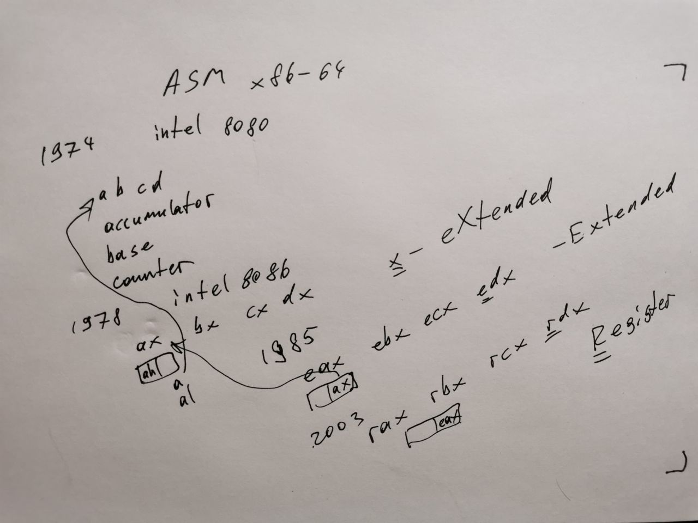

# Assembler x86

<table width=100%> <tr>
    <th width=20%> <b>Видеозапись семинара &rarr; </b> </th>
    <th>
    <a href="https://www.youtube.com/watch?v=OYgKVtWp2l4&list=PLjzMm8llUm4AmU6i_hPU0NobgA4VsBowc&index=6">
         
    </a>
    </th>
    <th> </th>
 </table>

## Особенности
* Мало регистров
* Много команд
* Много легаси
* Много соглашений о вызовах
* Разные синтаксисы


[Ридинг Яковлева](https://github.com/victor-yacovlev/mipt-diht-caos/tree/master/practice/asm/x86_basics) 


Сегодня в программе:
* <a href="#regs" style="color:#856024"> Регистры </a>
* <a href="#syntax" style="color:#856024"> Синтаксисы </a>
* <a href="#clamp" style="color:#856024"> Функция clamp </a>
* <a href="#asm" style="color:#856024"> Работа с памятью </a>
* <a href="#mul" style="color:#856024"> Интересные факты </a>
* <a href="#hw" style="color:#856024"> Комментарии к ДЗ </a>

#  <a name="regs"></a> Регистры

Немного истории

| Год  | Регистры           | Битность | Первый процессор | Комментарий |
|------|--------------------|----------|------------------|-------------|
| 1974 | a, b, c, d         | 8 bit    | Intel 8080       | |
| 1978 | ax, bx, cx, dx     | 16 bit   | Intel 8086       | |
| 1985 | eax, ebx, exc, edx | 32 bit   | Intel 80386      | E - extended |
| 2003 | rax, rbx, rcx, rdx | 64 bit   | AMD Opteron      | R - (внезапно) register |


Как оно выглядит сейчас в 64-битных процессорах

<table width="800px" border="1" style="text-align:center; font-family: Courier New; font-size: 10pt">

<tbody><tr>
<td colspan="8" width="25%" style="background:lightgrey">RAX

<td colspan="8" width="25%" style="background:lightgrey">RCX

<td colspan="8" width="25%" style="background:lightgrey">RDX

<td colspan="8" width="25%" style="background:lightgrey">RBX

<tr>
<td colspan="4" width="12.5%">
<td colspan="4" width="12.5%" style="background:lightgrey">EAX

<td colspan="4" width="12.5%">
<td colspan="4" width="12.5%" style="background:lightgrey">ECX

<td colspan="4" width="12.5%">
<td colspan="4" width="12.5%" style="background:lightgrey">EDX

<td colspan="4" width="12.5%">
<td colspan="4" width="12.5%" style="background:lightgrey">EBX

<tr>
<td colspan="6" width="18.75%">
<td colspan="2" width="6.25%" style="background:lightgrey">AX

<td colspan="6" width="18.75%">
<td colspan="2" width="6.25%" style="background:lightgrey">CX

<td colspan="6" width="18.75%">
<td colspan="2" width="6.25%" style="background:lightgrey">DX

<td colspan="6" width="18.75%">
<td colspan="2" width="6.25%" style="background:lightgrey">BX

<tr>
<td colspan="6" width="18.75%">
<td width="3.125%" style="background:lightgrey">AH
<td width="3.125%" style="background:lightgrey">AL

<td colspan="6" width="18.75%">
<td width="3.125%" style="background:lightgrey">CH
<td width="3.125%" style="background:lightgrey">CL

<td colspan="6" width="18.75%">
<td width="3.125%" style="background:lightgrey">DH
<td width="3.125%" style="background:lightgrey">DL

<td colspan="6" width="18.75%">
<td width="3.125%" style="background:lightgrey">BH
<td width="3.125%" style="background:lightgrey">BL
</tbody></table>


Регистры в x86:
    
<br> `eax`, `ebx`, `ecx`, `edx` - регистры общего назначения.
<br> `esp` - указатель на вершину стека
<br> `ebp` - указатель на начало фрейма (но можно использовать аккуратно использовать как регистр общего назначения)
<br> `esi`, `edi` - странные регистры для копирования массива, по сути регистры общего назначения, но ограниченные в возможностях.

Возвращаемое значение записывается в регистр eax.

Вызываемая функция **обязана сохранять на стеке значения регистров** общего назначения `ebx`, `ebp`, `esi` и `edi`.

Аргументы могут передаваться в функцию различными способами, в зависимости от соглашений, принятых в ABI (смотрите ридинг Яковлева).


```python
%%save_file asm_filter_useless
%run chmod +x asm_filter_useless
#!/bin/bash
grep -v "^\s*\." | grep -v "^[0-9]"
```

#  <a name="syntax"></a> Syntaxes
### AT&T


```cpp
%%cpp att_example.c
%run gcc -m32 -masm=att -O3 att_example.c -S -o att_example.S
%run cat att_example.S | ./asm_filter_useless

#include <stdint.h>
    
int32_t sum(int32_t a, int32_t b) {
    return a + b;
}
```

### Intel

DWORD PTR — это переменная типа двойного слова. Слово — это 16 бит. Термин получил распространение в эпоху 16-ти битных процессоров, тогда в регистр помещалось ровно 16 бит. Такой объем информации стали называть словом (word). Т. е. в нашем случае dword (double word) 2*16 = 32 бита = 4 байта (обычный int). 

https://habr.com/ru/post/344896/


```cpp
%%cpp intel_example.c
%run gcc -m32 -masm=intel -O3 intel_example.c -S -o intel_example.S
%run cat intel_example.S | ./asm_filter_useless

#include <stdint.h>
    
int32_t sum(int32_t a, int32_t b) {
    return a + b;
}
```

Про `endbr32` [Введение в аппаратную защиту стека / Хабр](https://habr.com/ru/post/494000/) и [control-flow-enforcement-technology](https://software.intel.com/sites/default/files/managed/4d/2a/control-flow-enforcement-technology-preview.pdf)

TLDR: чтобы хакерам было сложнее, есть особый режим процессора, в котором переход (jump) к инструкции не являющейся `endbr*` приводит к прерыванию и завершению программы.

#  <a name="clamp"></a> Пишем функцию clamp тремя способами


```python
%%asm clamp_disasm.S
.intel_syntax noprefix
.text
.globl clamp
clamp:
    mov edx, DWORD PTR [esp+4]
    mov eax, DWORD PTR [esp+8]
    cmp edx, eax
    jl .L2
    cmp edx, DWORD PTR [esp+12]
    mov eax, edx
    cmovg eax, DWORD PTR [esp+12]
.L2:
    rep ret
```


```python
%%asm clamp_if.S
.intel_syntax noprefix
.text
.globl clamp
clamp:
    mov edx, DWORD PTR [esp + 4] // X
    mov eax, DWORD PTR [esp + 8] // A
    cmp edx, eax
    jl return_eax // return A if X < A
    mov eax, DWORD PTR [esp + 12] // B
    cmp edx, eax
    jg return_eax // return B if X > B
    mov eax, edx
return_eax:
    ret
```


```python
%%asm clamp_cmov.S
.intel_syntax noprefix
.text
.globl clamp
clamp:
    mov eax, DWORD PTR [esp + 4] // X
    mov edx, DWORD PTR [esp + 8] // A
    cmp eax, edx
    cmovl eax, edx               // if (X < A) X = A 
    mov edx, DWORD PTR [esp + 12] // B
    cmp eax, edx
    cmovg eax, edx               // if (X > B) X = B
    ret
```


```cpp
%%cpp clamp_test.c
// compile and test using all three asm clamp implementations
%run gcc -m32 -masm=intel -O2 clamp_disasm.S clamp_test.c -o clamp_test.exe
%run ./clamp_test.exe
%run gcc -m32 -masm=intel -O2 clamp_if.S clamp_test.c -o clamp_if_test.exe
%run ./clamp_if_test.exe
%run gcc -m32 -masm=intel -O2 clamp_cmov.S clamp_test.c -o clamp_cmov_test.exe
%run ./clamp_cmov_test.exe

#include <stdint.h>
#include <stdio.h>
#include <assert.h>
    
int32_t clamp(int32_t a, int32_t b, int32_t c);

int main() {
    assert(clamp(1, 10, 20) == 10);
    assert(clamp(100, 10, 20) == 20);
    assert(clamp(15, 10, 20) == 15);
    fprintf(stderr, "All is OK");
    return 0;
}
```

То же самое ассемблерной вставкой


```cpp
%%cpp clamp_inline_test.c
%run gcc -m32 -masm=intel -O2 clamp_inline_test.c -o clamp_inline_test.exe
%run ./clamp_inline_test.exe

#include <stdint.h>
#include <stdio.h>
#include <assert.h>
    
int32_t clamp(int32_t a, int32_t b, int32_t c);
__asm__(R"(
clamp:
    mov eax, DWORD PTR [esp + 4]
    mov edx, DWORD PTR [esp + 8]
    cmp eax, edx
    cmovl eax, edx
    mov edx, DWORD PTR [esp + 12]
    cmp eax, edx
    cmovg eax, edx
    ret
)");

int main() {
    assert(clamp(1, 10, 20) == 10);
    assert(clamp(100, 10, 20) == 20);
    assert(clamp(15, 10, 20) == 15);
    fprintf(stderr, "All is OK");
    return 0;
}
```

#  <a name="memory"></a> Поработаем с памятью

Даны n, x. Посчитаем $\sum_{i=0}^{n - 1} (-1)^i \cdot x[i]$


```python
%%asm my_sum.S
.intel_syntax noprefix
.text
.globl my_sum
my_sum:
    push ebx
    mov eax, 0
    mov edx, DWORD PTR [esp + 8]
    mov ebx, DWORD PTR [esp + 12]
start_loop:
    cmp edx, 0
    jle return_eax
    add eax, DWORD PTR [ebx]
    add ebx, 4
    dec edx
    
    cmp edx, 0
    jle return_eax
    sub eax, DWORD PTR [ebx]
    add ebx, 4
    dec edx
    
    jmp start_loop
return_eax:
    pop ebx
    ret
```


```cpp
%%cpp my_sum_test.c
%run gcc -g3 -m32 -masm=intel my_sum_test.c my_sum.S -o my_sum_test.exe
%run ./my_sum_test.exe

#include <stdint.h>
#include <stdio.h>
#include <assert.h>
    
int32_t my_sum(int32_t n, int32_t* x);

int main() {
    int32_t x[] = {100, 2, 200, 3};
    assert(my_sum(sizeof(x) / sizeof(int32_t), x) == 100 - 2 + 200 - 3);
    int32_t y[] = {100, 2, 200};
    assert(my_sum(sizeof(y) / sizeof(int32_t), y) == 100 - 2 + 200);
    return 0;
}
```

#  <a name="mul"></a> Развлекательно-познавательная часть


```cpp
%%cpp mul.c
%run gcc -m32 -masm=intel -O3 mul.c -S -o mul.S
%run cat mul.S | ./asm_filter_useless

#include <stdint.h>
    
int32_t mul(int32_t a) { 
    return a * 2;
}
```


```cpp
%%cpp div_0.c
%run gcc -m64 -masm=intel -O3 div_0.c -S -o div_0.S
%run cat div_0.S | ./asm_filter_useless

#include <stdint.h>
    
uint32_t div(uint32_t a) { 
    return a / 11;
}

uint32_t div2(uint32_t a, uint32_t b) { 
    return a / b;
}
```


```cpp
%%cpp div.c
%run gcc -m32 -masm=intel -O3 div.c -S -o div.S
%run cat div.S | ./asm_filter_useless

#include <stdint.h>
    
int32_t div(int32_t a) { 
    return a / 4;
}

uint32_t udiv(uint32_t a) { 
    return a / 2;
}
```

# <a name="inline"></a> Inline ASM
http://asm.sourceforge.net/articles/linasm.html


```cpp
%%cpp simdiv.c
%run gcc -m32 -masm=intel -O3 simdiv.c -o simdiv.exe
%run ./simdiv.exe

#include <stdint.h>
#include <assert.h>
    
int32_t simdiv(int32_t a) { 
    uint32_t eax = ((uint32_t)a >> 31) + a;
    __asm__("sar %0" : "=a"(eax) : "a"(eax));
    return eax;
}

int main() {
    assert(simdiv(1) == 0);
    assert(simdiv(5) == 2);
    assert(simdiv(-1) == 0);
    assert(simdiv(-5) == -2);
}
```


```python

```


```python

```

##  <a name="hw"></a> Комментарии к дз


```python

```
