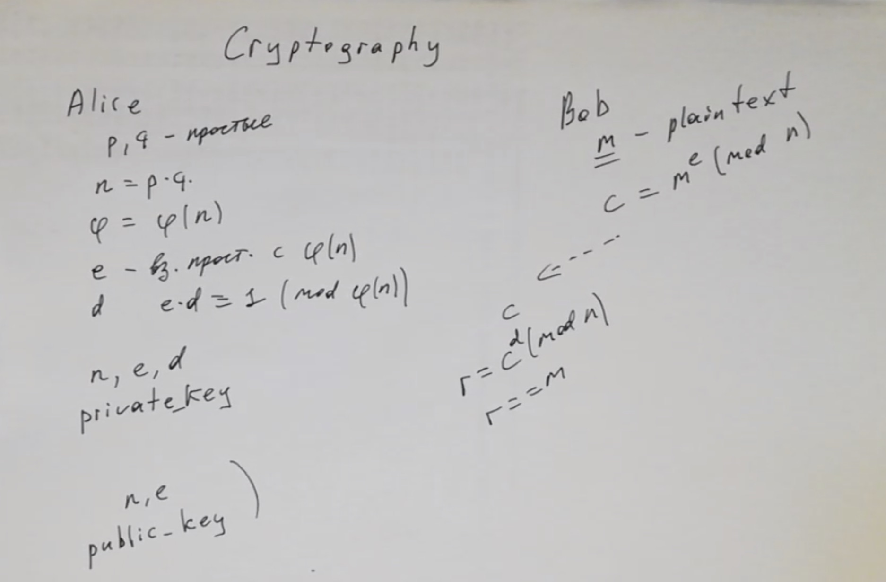

# Опрос для всех, кто зашел на эту страницу

Он не страшный, там всего два обязательных вопроса на выбор одного варианта из трёх. Извиняюсь за размер, но к сожалению студенты склонны игнорировать опросы :| 

Пытаюсь компенсировать :)

<a href="https://docs.google.com/forms/d/e/1FAIpQLSdUnBAae8nwdSduZieZv7uatWPOMv9jujCM4meBZcHlTikeXg/viewform?usp=sf_link"></a>

# Криптография, openssl

<table width=100%  > <tr>
    <th width=15%> <b>Видео с семинара &rarr; </b> </th>
    <th>
    <a href="https://youtu.be/MYAos8P0rfw"></a>
    </th>
    <th> </th>
 </table>

Сегодня в программе:
* <a href="#hash" style="color:#856024"> Хеши </a>
* <a href="#salt" style="color:#856024"> Соль </a>
* <a href="#symmetric" style="color:#856024"> Симметричное шифрование </a>
* <a href="#asymmetric" style="color:#856024"> Асимметричное шифрование </a>
* <a href="#libcrypto" style="color:#856024"> libcrypto </a>
    

[Ридинг Яковлева](https://github.com/victor-yacovlev/mipt-diht-caos/tree/master/practice/openssl)
  
  
<a href="#hw" style="color:#856024">Комментарии к ДЗ</a>


##  <a name="hash"></a>  Хеши

Цель хеш-функции - конвертировать произвольную последовательность бит (строку) в последовательность бит фиксированной длины (хеш-значение). При этом делать это таким образом, чтобы восстановить по хеш-значению исходную строку было крайне сложно.

(Это очень упрощенно, более детально можно посмотреть [на википедии](https://ru.wikipedia.org/wiki/Криптографическая_хеш-функция#Требования))

Самое очевидное применение хешей - хранение паролей пользователей на диске


```bash
%%bash

echo "user=Vasya password_hash=$(echo -n 12345 | openssl sha256 -r)"
echo "user=Petya password_hash=$(echo -n asfjdjdvsdf | openssl sha256 -r)"
echo "user=admin password_hash=$(echo -n qwerty | openssl sha256 -r)"
```

    user=Vasya password_hash=5994471abb01112afcc18159f6cc74b4f511b99806da59b3caf5a9c173cacfc5 *stdin
    user=Petya password_hash=9513963c366d0baccdbcd507bd1d78fa9c1a21aa102c30af3bb20f167fde8f2e *stdin
    user=admin password_hash=65e84be33532fb784c48129675f9eff3a682b27168c0ea744b2cf58ee02337c5 *stdin


Тогда потенциальному злоумышленнику, чтобы получить пароль (или эквивалент пароля) нужно по хешу восстановить прообраз хеш-функции, что сложно, если пароль сложный, а хеш-функция хорошая.

Однако в приведенной схеме есть дыра. Какая?

<details> <summary> (большой блок из пустых строк) </summary>
  <p> <br><br><br><br><br><br><br><br><br><br><br><br><br><br> </p>
</details>

##  <a name="salt"></a>  Соль


```bash
%%bash
echo "user=Vasya password_hash=$(echo -n 3.1415-2.718182 | openssl sha256 -r)"
echo "user=Petya password_hash=$(echo -n sfkjvdjkth | openssl sha256 -r)"
echo "user=admin password_hash=$(echo -n 3.1415-2.718182 | openssl sha256 -r)"
```

    user=Vasya password_hash=a6f62b5131e63fac2e6f1be3e443a12e58e2c5fea002df0924f58eeefb7e81a9 *stdin
    user=Petya password_hash=eea9d8bec1b74e88807bf93f3a0e095df6543b83d46550456d7f8d2139c0db5c *stdin
    user=admin password_hash=a6f62b5131e63fac2e6f1be3e443a12e58e2c5fea002df0924f58eeefb7e81a9 *stdin


Пусть здесь получить пароли по хешам все еще сложно, 
но можно получить другую информацию: что у `Vasya` и `admin` совпадают пароли.
    
А если злоумышленник мыслит широко, он может просто подкараулить Васю в темном подъезде. И получить пароль админа.

Чтобы злоумышленник не мог получить информацию о совпадении паролей, можно использовать соль.


```bash
%%bash
echo "user=Vasya salt=saltAHFG password_hash=$(echo -n saltAHFG%3.1415-2.718182 | openssl sha256 -r)"
echo "user=Petya salt=saltMSIG password_hash=$(echo -n saltMSIG%sfkjvdjkth | openssl sha256 -r)"
echo "user=admin salt=saltPQNY password_hash=$(echo -n saltPQNY%3.1415-2.718182 | openssl sha256 -r)"
```

    user=Vasya salt=saltAHFG password_hash=0c9ce37e04e94dc13f16304a93b21e7f2c44ca32d6c26fbea3375ea85263aaa0 *stdin
    user=Petya salt=saltMSIG password_hash=df9c27cc066b36be6dc73a39f03e73ec4996b378bfff562421e53bf85f3a99c5 *stdin
    user=admin salt=saltPQNY password_hash=8af9bf88fbe91b010c37d5065c90935c5bb51f5e2898bd92a7235581bd0ccb36 *stdin


Теперь информации о совпадении паролей у злоумышленника так же нет.

##  <a name="symmetric"></a>  Симметричное шифрование

Позволяет шифровать большие объемы текста. Для шифрования и расшифровки используется общий секрет.

### Шифроблокноты

Это самый надежный из симметричных шифров: генерируется случайная последовательность большой длины и становится ключом.

https://ru.wikipedia.org/wiki/Шифр_Вернама

https://habr.com/ru/post/347216/


```python
import random
import base64

def xor(x, y):
    return bytes(a ^ b for a, b in zip(x, y))

%p # both Alice and Bob
common_secret = bytes(random.randint(0, 255) for i in range(35))  # на самом деле тут стоило бы исплользовать более надежный генератор случайных чисел 
%p base64.b64encode(common_secret)  # Содержимое шифроблокнота

%p # Alice → 
plain_text = b"there are several spy secrets here"
%p plain_text  # Текст, который хотим зашифровать (Алиса хочет отправить его Бобу)
cipher_text = xor(plain_text, common_secret)
%p base64.b64encode(cipher_text)  # Шифротекст

%p #  → Bob
recovered_plain_text = xor(cipher_text, common_secret)
%p recovered_plain_text  # Текст, который получил Боб

```


both Alice and Bob


`base64.b64encode(common_secret) = b't3DnjBipwdICZrbWIvgW3q4m7LnfOsLw0zjHji+nuIL7yRg='`  # Содержимое шифроблокнота


Alice →


`plain_text = b'there are several spy secrets here'`  # Текст, который хотим зашифровать (Алиса хочет отправить его Бобу)


`base64.b64encode(cipher_text) = b'wxiC/n2JoKBnRsWzVJ1kv8IGn8mmGrGVsEqi+lyH0OeJrA=='`  # Шифротекст


→ Bob


`recovered_plain_text = b'there are several spy secrets here'`  # Текст, который получил Боб


Но есть очевидный минус - общий секрет должет быть размера не меньшего, чем весь объем отправляемых данных.

## Блочное шифррование

По сути пара функций: `output_block = E(input_block, secret)` и обратная к ней. `output_block`, `input_block` и `secret`- строки фиксированной длины. Обычно число фигурирующее в названии блочного шифра (aes-256) - это длина ключа в битах.

https://ru.wikipedia.org/wiki/Блочный_шифр

https://ru.wikipedia.org/wiki/Блочный_шифр#Определение

https://ru.wikipedia.org/wiki/Режим_шифрования#Counter_mode_(CTR)

Казалось бы теперь можно просто зашифровать текст, просто применив функцию блочного шифра поблочно к тексту (называется режимом шифрования ECB), но нет! Иначе есть шанс получить что-то такое :)

<table> 
<tr>
    <th> Исходное изображение </th> <th> Изображение зашифрованное в режиме ECB </th> 

<tr>
    <th> 
        
    </th>
    <th>
        
    </th>
 
</table>


Один из режимов шифрования (способов использования функции блочного шифра) - режим CTR. С ним нет такой проблемы как с ECB. И он очень простой по сути.

Идея в том, чтобы как бы генерировать шифроблокнот на ходу, используя функцию блочного шифра.

Примерно так: `E(nonce*1e9 + 0, secret), E(nonce*1e9 + 1, secret), E(nonce*1e9 + 2, secret), ...`.

`nonce` - Number used ONCE - однократно используемое число. Чтобы функция блочного шифра с одним ключом никогда не применялась для шифрования одного и того же входного блока. `nonce` обычно передается в незашифрованном виде.


```bash
%%bash
export MY_PASSWORD=MY_SECRET_PASSWORD

echo "Alice → "
echo -n "Some secret message" > plain_text.txt
echo "  Plain text: '$(cat plain_text.txt)'"
SALT=$(openssl rand -hex 8)
echo "  Salt is: $SALT"
openssl enc -aes-256-ctr -e -S $SALT -in plain_text.txt -out cipher_text.txt -pass env:MY_PASSWORD
echo "  Ciphertext base64: '$(base64 cipher_text.txt)'"

echo "→  Bob"
echo "  Ciphertext base64: '$(base64 cipher_text.txt)'"
openssl enc -aes-256-ctr -d -in cipher_text.txt -out recovered_plain_text.txt -pass env:MY_PASSWORD
echo "  Recovered plaintext: '$(cat recovered_plain_text.txt)'"
```

    Alice → 
      Plain text: 'Some secret message'
      Salt is: 220b054eafaafa61
      Ciphertext base64: 'U2FsdGVkX18iCwVOr6r6YU5US9agAA8WWuDCi5HSNuoPSaY='
    →  Bob
      Ciphertext base64: 'U2FsdGVkX18iCwVOr6r6YU5US9agAA8WWuDCi5HSNuoPSaY='
      Recovered plaintext: 'Some secret message'


Можно еще глянуть на структуру зашифрованного с помощью утилиты сообщения:


```bash
%%bash
export MY_PASSWORD=MY_SECRET_PASSWORD
echo -n "Some secret message!" > plain_text.txt
SALT='66AA1122060A0102'

echo "Case 1. Use pass phrase:"
echo "Plain text: '$(cat plain_text.txt)' ($(cat plain_text.txt | wc -c) bytes)"                                             | sed -e 's/^/  /'
# sed -e 's/^/  /' -- просто добавляет отступ в два пробела к каждой выведенной строке
# -p -- опция, чтобы выводить соль, ключ, стартовый вектор
openssl enc -aes-256-ctr -S $SALT -in plain_text.txt -out cipher_text.txt -pass env:MY_PASSWORD -p                           | sed -e 's/^/  /'
echo -e "Ciphertexthexdump: '''\n$(hexdump cipher_text.txt -C)\n''' ($(cat cipher_text.txt | wc -c) bytes)"                     | sed -e 's/^/  /'
openssl enc -aes-256-ctr -d -in cipher_text.txt -out recovered_plain_text.txt -pass env:MY_PASSWORD 
echo "Recovered plaintext: '$(cat recovered_plain_text.txt)'"                                                                | sed -e 's/^/  /'


IV='E4DEC57ADC9A771DC72A77775A1CF4FF'
KEY='BBC5929AA59B56851391DD723922C2E0F31A2FC873D52D3FBA3FD5391CAD471E'
echo "Case 2. Use explicit key and IV:"
echo "Plain text: '$(cat plain_text.txt)' ($(cat plain_text.txt | wc -c) bytes)"                                             | sed -e 's/^/  /'
openssl enc -aes-256-ctr -in plain_text.txt -out cipher_text.txt -iv $IV -K $KEY -p                                          | sed -e 's/^/  /'
echo -e "Ciphertexthexdump: '''\n$(hexdump cipher_text.txt -C)\n''' ($(cat cipher_text.txt | wc -c) bytes)"                     | sed -e 's/^/  /'
openssl enc -aes-256-ctr -d -in cipher_text.txt -out recovered_plain_text.txt -iv $IV -K $KEY
echo "Recovered plaintext: '$(cat recovered_plain_text.txt)'"                                                                | sed -e 's/^/  /'


echo "Case 3. Encode with EBC mode and decode with CTR mode (IV=0):"
IV='00000000000000000000000000000000'
KEY='BBC5929AA59B56851391DD723922C2E0F31A2FC873D52D3FBA3FD5391CAD471E'
echo -n -e "\0\0\0\0\0\0\0\0\0\0\0\0\0\0\0\0\0\0\0\0" > plain_text.txt
echo -e "Plain text: '''$(cat plain_text.txt | hexdump -v -e '/1 "%02X "')''' ($(cat plain_text.txt | wc -c) bytes)"                             | sed -e 's/^/  /'
openssl enc -aes-256-ecb -in plain_text.txt -out cipher_text.txt -K $KEY -p                                          | sed -e 's/^/  /'
echo -e "Ciphertexthexdump: '''\n$(hexdump cipher_text.txt -C)\n''' ($(cat cipher_text.txt | wc -c) bytes)"                     | sed -e 's/^/  /'
openssl enc -aes-256-ctr -d -in cipher_text.txt -out recovered_plain_text.txt -iv $IV -K $KEY
echo -e "Recovered plaintext: '''\n$(hexdump recovered_plain_text.txt)\n''' ($(cat recovered_plain_text.txt | wc -c) bytes)" | sed -e 's/^/  /'

```

    Case 1. Use pass phrase:
      Plain text: 'Some secret message!' (20 bytes)
      salt=66AA1122060A0102
      key=BBC5929AA59B56851391DD723922C2E0F31A2FC873D52D3FBA3FD5391CAD471E
      iv =E4DEC57ADC9A771DC72A77775A1CF4FF
      Ciphertexthexdump: '''
      00000000  53 61 6c 74 65 64 5f 5f  66 aa 11 22 06 0a 01 02  |Salted__f.."....|
      00000010  ca 12 3b 51 34 0e 2d 52  3c 38 36 66 6f 74 4f 57  |..;Q4.-R<86fotOW|
      00000020  bc 8b d6 e0                                       |....|
      00000024
      ''' (36 bytes)
      Recovered plaintext: 'Some secret message!'
    Case 2. Use explicit key and IV:
      Plain text: 'Some secret message!' (20 bytes)
      salt=0000000000000000
      key=BBC5929AA59B56851391DD723922C2E0F31A2FC873D52D3FBA3FD5391CAD471E
      iv =E4DEC57ADC9A771DC72A77775A1CF4FF
      Ciphertexthexdump: '''
      00000000  ca 12 3b 51 34 0e 2d 52  3c 38 36 66 6f 74 4f 57  |..;Q4.-R<86fotOW|
      00000010  bc 8b d6 e0                                       |....|
      00000014
      ''' (20 bytes)
      Recovered plaintext: 'Some secret message!'
    Case 3. Encode with EBC mode and decode with CTR mode (IV=0):
      Plain text: '''00 00 00 00 00 00 00 00 00 00 00 00 00 00 00 00 00 00 00 00 ''' (20 bytes)
      salt=0000000000000000
      key=BBC5929AA59B56851391DD723922C2E0F31A2FC873D52D3FBA3FD5391CAD471E
      Ciphertexthexdump: '''
      00000000  3b 0f 19 a6 fe c8 60 68  14 6a a6 8f 49 4b 03 bb  |;.....`h.j..IK..|
      00000010  76 92 ad 2e d1 02 aa 75  08 0e 27 92 a4 0e 87 30  |v......u..'....0|
      00000020
      ''' (32 bytes)
      Recovered plaintext: '''
      0000000 0000 0000 0000 0000 0000 0000 0000 0000
      0000010 6fb5 ede7 1427 2c9b b25b c5d6 f4be a0be
      0000020
      ''' (32 bytes)


Несложно догадаться, что в Case 1 добавляется 16 байт метаинформации. И в этих байтах легко узнается наша соль и слово `Salted__`.

А в Case 2 ничего не добавляется (длина не увеличивается по сравнению с plaintext). Так что судя по всему там просто xor со сгенерированным шифроблокнотом

Case 3 просто извращенный пример: первый блок текста $P_0$ шифруется в режиме ECB, получается $E_k(P_0)$. А потом декодируется в режиме CTR (с IV=0), получается $E_k(P_0)$ ^ $E_k(0)$. А так как $P_0$ в примере сам равен 0, то получается, что $E_k(P_0)$ ^ $E_k(0) = E_k(0)$ ^ $E_k(0) = 0$. То есть удачненько так расшифрованное совпало с исходным текстом :) Это вообще не то, что может пригодиться на практике, просто забавный примерчик.


```python
!openssl rand -base64 30
```

## Имитовставка

Шифроблокноты хорошо защищают текст, от того, чтобы злоумышленник смог этот текст узнать. Но что если злоумышленник и так знает текст (документ с размерами зарплат), и его цель подменить там одно число? Тогда ему не нужно расшифровывать документ, он может его перехватить, инвертировать один бит в нужном месте и отправить дальше.

Бороться с этим можно хемсуммой. При этом не простой (чтобы злоумышленник не мог ее пересчитать), а параметризованной ключом шифрования. Такая хешсумма называется имитовставкой.

##  <a name="asymmetric"></a>  Acимметричное шифрование

В симметричном шифровании у отправителя и получателя должен быть общий секрет. А что делать если его нет? Использовать асимметричное шифрование!

Обычно применяется для обмена некоторой метаинформацией и получения общего секрета.


### Протокол Диффи-Хеллмана

Допустим два агента хотят пообщаться, но у них нет общего ключа и их могу прослушивать. Что делать?

Использовать труднорешаемую задачу :)

Например, это может быть задача дискретного логарифмирования (взятия логарифма в кольце по модулю).

Тогда агенты A и B могут сообща выбрать основание $x$ (через незащищенный канал), потом раздельно выбрать случайные числа $a$, $b$. Возвести $x$ в эти степени и обменяться полученными $x^a$, $x^b$ через незащищенный канал.

Фокус в том, что сейчас люди не умеют по $x$ и $x^a$ находить $a$. Так что $x^a$ передавать безопасно.

А дальше второй фокус: агент A может сделать $(x^b)^a = x^{(a \cdot b)}$, а агент B - $(x^a)^b = x^{(a \cdot b)}$. И получается, что у A и B есть общий секрет. А злоумышленник имея только $x, x^b, x^a$ не может получить $x^{(a \cdot b)}$.

https://ru.wikipedia.org/wiki/Протокол_Диффи_—_Хеллмана

### RSA 

(Rivest, Shamir и Adleman)

https://ru.wikipedia.org/wiki/RSA#Алгоритм_создания_открытого_и_секретного_ключей


```bash
%%bash

echo "+++ Alice generate key"
openssl genrsa -out alice_private_key 2048 2>&1
openssl rsa -in alice_private_key -out alice_public_key -pubout 2>&1

echo "Bob → "
echo -n "Bob's secret message" > bobs_plaintext
echo "  Bob ciphers message: '$(cat bobs_plaintext)'"
openssl rsautl -encrypt -pubin -inkey alice_public_key -in bobs_plaintext -out bobs_ciphertext
echo "  Encrypted message: $(base64 bobs_ciphertext)"

echo "→ Alice"
openssl rsautl -decrypt -inkey alice_private_key -in bobs_ciphertext -out recovered_bobs_plaintext
echo "  Decrypted message: '$(cat recovered_bobs_plaintext)'"
```

    +++ Alice generate key
    Generating RSA private key, 2048 bit long modulus
    .................................................................................................................................................................................................+++
    ..........................................+++
    e is 65537 (0x10001)
    writing RSA key
    Bob → 
      Bob ciphers message: 'Bob's secret message'
      Encrypted message: ZqHFa3tETajZoyUx+yxmi4utzVQaeRTBywtm7sohctBUtI6OYIRF1h5lmjf3KWuUrEM+rEpHeeHu
    wXEl1aHf+G2kAsxtHl2zwxBhHxF8Y1PFAjEDLZaOFrS9BmeH4Zlz2MtOIlDUeZjR/ejUM4Jvq0ig
    9LMwed9QLzsZZz9H1pX4CIY1SDMyW/R4FgkvS9lA1RErybIYLUq9wzU04Z0EBXjDm18dkpiU3I/5
    JJimI767Yxgh8QxYhjK7Xo06fgj+dZ+pIEOAB+QOgPrEQucr6zGmQopOCT5uwnEKjBjDpZzvTf40
    sPxjqHJpeOXmTS1P/65MpsSx4tmpXIVbmAS4ig==
    → Alice
      Decrypted message: 'Bob's secret message'


В этом примере RSA использовался не по назначению, так как нельзя зашифровать текст, который длиннее ключа. При передаче большого текста, стоило через RSA договориться об общем секрете, а потом передавать большой текст используя блочное шифрование.

##  <a name="libcrypto"></a>  libcrypto

Ссылочки:

https://wiki.openssl.org/index.php/Libcrypto_API

https://wiki.openssl.org/index.php/EVP_Symmetric_Encryption_and_Decryption - отсюда взят пример

https://github.com/openssl/openssl

https://www.openssl.org/docs/man1.1.1/

И пример с шифрованием-дешифрованием с блочным шифром AES-256 в режиме CTR.


```python
!mkdir libcrypto_example || true
```


```cmake
%%cmake libcrypto_example/CMakeLists.txt

cmake_minimum_required(VERSION 2.8) 

set(CMAKE_CXX_FLAGS "-std=c++17")

find_package(OpenSSL COMPONENTS crypto REQUIRED)

add_executable(main main.cpp)
target_include_directories(main PUBLIC ${OPENSSL_INCLUDE_DIR}) 
target_link_libraries(main ${OPENSSL_CRYPTO_LIBRARY})            
```


```cpp
%%cpp libcrypto_example/main.cpp
%run mkdir libcrypto_example/build 
%run cd libcrypto_example/build && cmake .. > /dev/null && make  
%run libcrypto_example/build/main 
%run rm -r libcrypto_example/build

#include <openssl/conf.h>
#include <openssl/evp.h>
#include <openssl/err.h>
#include <string.h>
#include <assert.h>
#include <vector>
#include <iostream>

#define EVP_ASSERT(stmt) do { if (!(stmt)) { \
    fprintf(stderr, "Statement failed: %s\n", #stmt); \
    ERR_print_errors_fp(stderr); \
    abort(); \
} } while (false)

struct TByteString: std::vector<unsigned char> {
    using std::vector<unsigned char>::vector;
    int ssize() { return static_cast<int>(size()); }
    char* SignedData() { reinterpret_cast<const char*>(data()); };
};

TByteString operator "" _b(const char* data, std::size_t len) {
    auto start = reinterpret_cast<const unsigned char*>(data);
    return {start, start + len};
}

TByteString Encrypt(const TByteString& plaintext, const TByteString& key, const TByteString& iv) {
    TByteString ciphertext(plaintext.size(), 0); // Верно для режима CTR, для остальных может быть не так
     
    auto* ctx = EVP_CIPHER_CTX_new();
    EVP_ASSERT(ctx);

    assert(key.size() * 8 == 256); // check key size for aes_256
    assert(iv.size() * 8 == 128); // check iv size for cipher with block size of 128 bits
    EVP_ASSERT(1 == EVP_EncryptInit_ex(ctx, EVP_aes_256_ctr(), NULL, key.data(), iv.data()));

    int len;
    // В эту функцию можно передавать исходный текст по частям, выход так же пишется по частям
    EVP_ASSERT(1 == EVP_EncryptUpdate(ctx, ciphertext.data(), &len, plaintext.data(), plaintext.size()));
    // В конце что-то могло остаться в буфере ctx и это нужно дописать
    EVP_ASSERT(1 == EVP_EncryptFinal_ex(ctx, ciphertext.data() + len, &len));
    
    EVP_CIPHER_CTX_free(ctx);
    return ciphertext;
}

TByteString Decrypt(const TByteString& ciphertext, const TByteString& key, const TByteString& iv) {
    TByteString plaintext(ciphertext.size(), 0);
    
    auto* ctx = EVP_CIPHER_CTX_new();
    EVP_ASSERT(ctx);
    
    assert(key.size() * 8 == 256); // check key size for aes_256
    assert(iv.size() * 8 == 128); // check iv size for cipher with block size of 128 bits
    EVP_ASSERT(1 == EVP_DecryptInit_ex(ctx, EVP_aes_256_ctr(), NULL, key.data(), iv.data()));

    int len;
    EVP_ASSERT(1 == EVP_DecryptUpdate(ctx, plaintext.data(), &len, ciphertext.data(), ciphertext.size()));
    EVP_ASSERT(1 == EVP_DecryptFinal_ex(ctx, plaintext.data() + len, &len));
    
    EVP_CIPHER_CTX_free(ctx);
    return plaintext;
}

int main () {
    TByteString key = "01234567890123456789012345678901"_b; // A 256 bit key (common secret)
    TByteString iv = "0123456789012355"_b; // A 128 bit IV (initialization vector, can be public)
    
    printf("Alice →\n");
    TByteString plaintext = "The quick brown fox jumps over the lazy dog"_b; // Message to be encrypted
    printf("  Message to be encrypted: '%.*s'\n", plaintext.ssize(), plaintext.SignedData());
    TByteString ciphertext = Encrypt(plaintext, key, iv); // Encrypt the plaintext
    printf("  Ciphertext is:\n");
    BIO_dump_fp(stdout, ciphertext.SignedData(), ciphertext.size()); // Just pretty output
    
    printf("→ Bob\n");
    TByteString decryptedText = Decrypt(ciphertext, key, iv); // Decrypt the ciphertext

    printf("  Decrypted text is: '%.*s'\n", decryptedText.ssize(), decryptedText.SignedData());
    return 0;
}
```


Run: `mkdir libcrypto_example/build`


Run: `cd libcrypto_example/build && cmake .. > /dev/null && make`


    [35m[1mScanning dependencies of target main[0m
    [ 50%] [32mBuilding CXX object CMakeFiles/main.dir/main.cpp.o[0m
    [100%] [32m[1mLinking CXX executable main[0m
    [100%] Built target main


Run: `libcrypto_example/build/main`


    Alice →
      Message to be encrypted: 'The quick brown fox jumps over the lazy dog'
      Ciphertext is:
    0000 - c0 a8 cf ae fa 58 87 44-b2 19 ed a3 76 5e 82 7d   .....X.D....v^.}
    0010 - c3 e1 b9 03 f8 f1 be 76-63 9a a5 46 a1 5a 50 e0   .......vc..F.ZP.
    0020 - da 26 de 4d 5d 1a 06 ac-6a 0d 23                  .&.M]...j.#
    → Bob
      Decrypted text is: 'The quick brown fox jumps over the lazy dog'


Run: `rm -r libcrypto_example/build`


```python

```


```python

```

# <a name="hw"></a> Комментарии к ДЗ

* 
*


```python

```


```python

```
