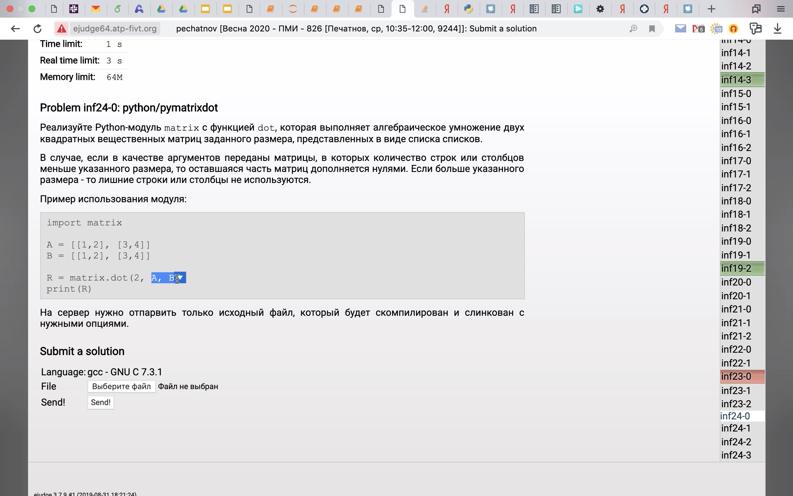

# Опрос для всех, кто зашел на эту страницу

Он не страшный, там всего два обязательных вопроса на выбор одного варианта из трёх. Извиняюсь за размер, но к сожалению студенты склонны игнорировать опросы :| 

Пытаюсь компенсировать :)

<a href="https://docs.google.com/forms/d/e/1FAIpQLSdUnBAae8nwdSduZieZv7uatWPOMv9jujCM4meBZcHlTikeXg/viewform?usp=sf_link"></a>


# Python bindings

<table width=100%  > <tr>
    <th width=15%> <b>Видео с семинара &rarr; </b> </th>
    <th>
    <a href="https://www.youtube.com/watch?v=DludPAH7Pbo&list=PLjzMm8llUm4CL-_HgDrmoSTZBCdUk5HQL&index=6"></a>
    </th>
    <th> </th>
 </table>

Сегодня в программе:
* Пишем модули для python (<a href="#why" style="color:#856024">а зачем это нужно?</a>):
  * <a href="#api" style="color:#856024"> Используя Python/C API </a>
  <br> Документация по api: https://docs.python.org/3/c-api/index.html
  * <a href="#ctypes" style="color:#856024"> Используя ctypes </a>
  * <a href="#cython" style="color:#856024"> Используя Cython </a>
  * <a href="#pybind" style="color:#856024"> Используя Pybind </a>
* <a href="#use_interpreter" style="color:#856024"> Исползуем интерпретатор Python из C </a>
 
[CPython на wiki](https://ru.wikipedia.org/wiki/CPython) (Не путать с Cython!)


[GIL](https://habr.com/ru/post/84629/) - почему многопоточность в pyhton это не многопоточность.

[Ссылки в python и соглашения об инкременте/декременте их счетчиков](https://pythonextensionpatterns.readthedocs.io/en/latest/refcount.html#python-terminology)

[Ридинг Яковлева](https://github.com/victor-yacovlev/mipt-diht-caos/tree/master/practice/python) (Он появился)

TODO: очень жестко по объему материала получилось, про Cython не стоило рассказывать, наверное.
  
<a href="#hw" style="color:#856024">Комментарии к ДЗ</a>


## <a name="why"></a>  Мотивашка

Python сейчас довольно распространенный язык, широко применяемый в машинном обучении, аналитике, во всех местах, где нужно писать скрипты, которые не пишутся очевидным образом на bash...

Зачем вообще может понадобиться писать модули для Python на других языках?
1. Желание/необходимость переиспользовать библиотеку написанную на другом языке. Не будете же вы писать алгоритм, например, приведения матрицы к нормальной Жордановой форме, на всех исопльзуемых в проекте языках?
2. Скорость. Если у вас есть код на питоне, то очевидный способ его ускорить - переписать все или критичную часть на более низкоуровневом языке. Переписать большой проект за один подход крайне сложно, поэтому даже в этом случае удобно сначала переписывать отдельные модули.
3. Многопоточность. Если вы хотите эффективно распараллелить некоторый объем CPU работы, то в питоне из-за GIL вы это сделать не сможете. Так что придется писать модуль.
4. Необходимость совершить низкоуровневые действия, которые нельзя сделать из Python. Например, как-то хитро поделать системные вызовы.

## Немного про None и nullptr


```python
def f():
    pass
    # что вернет функция f?
```


```python
type(f()) # она вернет None
```

`None` это специальное значение в python. Оно возвращается функциями, которые `void` в терминах C. Оно используется как отсутствие значения в методе `.get` у `dict`:


```python
type({"a": 1}.get('b'))
```

В общем используется так же, как часто используется `NULL`/`nullptr` в С/С++.

Но при этом в Python API `None` это не `NULL`. `None` это специальный синглтон-объект который используется в качестве особого значения. (В реализации красно-черного дерева иногда выделяют специальную вершину nil, тут примерно так же).

## <a name="api"></a> Python/C API

Пожалуй, это способ писать самые эффективные биндинги, так как этот способ самый низкоуровневый. Пишем функции для питона на C используя существующее python/c api.

Возможно у меня неправильный питон, но с адрес-санитайзером он у меня не дружит, всегда есть множественные утечки памяти. С clang вообще завести не получилось в ряде случаев. Когда получилось завести, отключаю обнаружение утечек.

https://habr.com/ru/post/469043/


```cpp
%%cpp c_api_module.c
%// Собираем модуль - динамическую библиотеку. Включаем нужные пути для инклюдов и динамические библиотеки
%run gcc -Wall c_api_module.c $(python3-config --includes --ldflags) -shared -fPIC -fsanitize=address -o c_api_module.so
#include <Python.h>

// Парсинг позиционных аргументов в лоб
static PyObject* func_1(PyObject* self, PyObject* args) {
    if (PyTuple_Size(args) != 2) {
        PyErr_SetString(PyExc_TypeError, "func_ret_str args error"); // выставляем ошибку
        return NULL; // возвращаем NULL - признак ошибки
    }
    long int val_i; char *val_s;
    // l - long int, s - char*
    if (!PyArg_ParseTuple(args, "ls", &val_i, &val_s)) {
        return NULL;
    }
    printf("func1: int - %ld, string - %s\n", val_i, val_s);
    return Py_BuildValue("is", val_i, val_s);
}

// Умный парсинг args и kwargs
static PyObject* func_2(PyObject* self, PyObject* args, PyObject* kwargs) {
    static const char* kwlist[] = {"val_i", "val_s", NULL};
    long int val_i = 0; char* val_s = ""; size_t val_s_len = 0;
    // до | обязательные аргументы, l - long int, z# - char* + size_t
    if (!PyArg_ParseTupleAndKeywords(args, kwargs, "l|z#", (char**)kwlist, &val_i, &val_s, &val_s_len)) {
        return NULL; // ошибка уже выставлена функцией PyArg_ParseTupleAndKeywords
    }
    printf("func2: int - %ld, string - %s, string_len = %zu\n", val_i, val_s, val_s_len);
    return Py_BuildValue("is", val_i, val_s);
}

// Список функций модуля
static PyMethodDef methods[] = {
    {"func_1", func_1, METH_VARARGS, "help func_1"},
    // METH_KEYWORDS - принимает еще и именованные аргументы
    {"func_2", (PyCFunction)func_2, METH_VARARGS | METH_KEYWORDS, "help func_2"},
    {NULL, NULL, 0, NULL}
};

// Описание модуля
static struct PyModuleDef module = {
    PyModuleDef_HEAD_INIT, "c_api_module", "Test module", -1, methods
};

// Инициализация модуля
PyMODINIT_FUNC PyInit_c_api_module(void) {
    PyObject* mod = PyModule_Create(&module);
    return mod;
}
```

Теперь заиспользуем библиотеку. Обратите внимание, что я для этого запускаю отдельный интерпретатор питона, а не делаю это просто в ячейке ноутбука.

Это из-за того, что если модуль с именем `c_api_module` был импортирован, то пусть он даже изменится - повторно его импортировать не получится. Можно каждый раз загружать его под новым именем, но это не очень удобно.

Когда будете делать домашку, учитывайте эту особенность.


```python
%%save_file api_module_example.py
%# Переменные окружения устанавливаются для корректной работы санитайзера
%run LD_PRELOAD=$(gcc -print-file-name=libasan.so) ASAN_OPTIONS=detect_leaks=0 python3 api_module_example.py | cat
import c_api_module

print(help(c_api_module))

print(c_api_module.func_1(10, "12343"))

print(c_api_module.func_2(10))
print(c_api_module.func_2(val_s="42", val_i=10))
print(c_api_module.func_2(10, val_s="42"))
```


```python
!echo $(clang -print-file-name=libasan.so)
```


```python
!ls /usr/bin/../lib/gcc/x86_64-linux-gnu/7.4.0/lib*so
```

Пример работы с более сложным типом - словариком. Без санитайзера на этот раз, чтобы хоть где-то были команды компиляции и запуска не усложненные костылями для запуска саниайзера.


```cpp
%%cpp c_api_module_2.c
%run clang -Wall c_api_module_2.c $(python3-config --includes --ldflags) -shared -fPIC -o c_api_module_2.so
#include <Python.h>

static PyObject* print_dict(PyObject* self, PyObject* args, PyObject* kwargs) {
    static const char* kwlist[] = {"d", NULL};
    PyObject* d;
    if (!PyArg_ParseTupleAndKeywords(args, kwargs, "O", (char**)kwlist, &d)) {
        return NULL;
    }
    Py_ssize_t ppos = 0;
    PyObject* pkey; PyObject* pvalue;
    while (PyDict_Next(d, &ppos, &pkey, &pvalue)) {
        const char* key = PyUnicode_AsUTF8(pkey);
        if (!key) return NULL;
        char value_storage[20];
        const char* value = value_storage; 
        if (PyLong_Check(pvalue)) {
            sprintf(value_storage, "%lld", PyLong_AsLongLong(pvalue));
        } else {
            value = PyUnicode_AsUTF8(pvalue);
            if (!value) return NULL;
        }
        
        printf("%s -> %s\n", key, value);
    }
    printf("\n");
    fflush(stdout);

    Py_RETURN_NONE;
}

// Список функций модуля
static PyMethodDef methods[] = {
    {"print_dict", (PyCFunction)print_dict, METH_VARARGS | METH_KEYWORDS, "print_dict"},
    {NULL, NULL, 0, NULL}
};

// Описание модуля
static struct PyModuleDef module = {
    PyModuleDef_HEAD_INIT, "c_api_module_2", "Test module", -1, methods
};

// Инициализация модуля
PyMODINIT_FUNC PyInit_c_api_module_2(void) {
    PyObject* mod = PyModule_Create(&module);
    return mod;
}
```


```python
%%save_file c_api_module_2_example.py
%run python3 c_api_module_2_example.py
import c_api_module_2

c_api_module_2.print_dict({"key1": "value1"})
c_api_module_2.print_dict({
    "key1": "value1",
    "key2": 42,
})
```


```python

```

## <a name="ctypes"></a> ctypes

Способ взаимодействовать с уже существующей скомпилированной библиотекой.

Очень просто в очень простых случаях. И не очень в сложных

https://habr.com/ru/post/466499/


```cpp
%%cpp ctypes_lib.c
%// Делаем самую обычную динамическую библиотеку
%run gcc -Wall ctypes_lib.c -shared -fPIC -fsanitize=address -o ctypes_lib.so

float sum_ab(int a, float b) {
    return a + b;
}
```


```python
%%save_file ctypes_example.py
%run LD_PRELOAD=$(gcc -print-file-name=libasan.so) ASAN_OPTIONS=detect_leaks=0 python3 ctypes_example.py

import ctypes 

ctypes_lib = ctypes.CDLL('./ctypes_lib.so')

sum_ab = ctypes_lib.sum_ab

sum_ab.restype = ctypes.c_float
sum_ab.argtypes = [ctypes.c_int, ctypes.c_float, ]

print(sum_ab(30, 1.5))
```


```python

```


```python

```

## <a name="cython"></a> Cython

[Cython на wiki](https://ru.wikipedia.org/wiki/Cython)

Высокоуровневый способ связывать код на С/С++ и Python. Связка идет через промежуточный код на промежуточном языке.

По задумке (в моем понимании), cython можно использовать для написания обвязки к существующей С++ библиотеке для ее переиспользования в Python.

Но если честно, то и чистый С++ код приходится немного адаптировать под Python. Так как там есть тонкости в пробросе исключений и еще какие-то.

Получается довольно много избыточного кода и файлов.

Но помимо биндингов cython можно использовать просто для ускорения python кода. Переименовываем .py в .pyx и, магия, добавилась статическая типизация, все начало работать быстрее.

`pip3 install --user cython`

Исходный код на C. Необязательно весь в хедере, просто так проще в этом примере, а то и так файлов много будет :)


```cpp
%%cpp pairs.h
#pragma once
#include <vector>
#include <algorithm>

struct TPairs {
    std::vector<std::pair<int, float>> Vector;
};

inline void SortPairs(TPairs& pairs) {
    std::sort(pairs.Vector.begin(), pairs.Vector.end());
}

inline void AppendPairs(TPairs& pairs, const TPairs& other) {
    pairs.Vector.insert(pairs.Vector.end(), other.Vector.begin(), other.Vector.end());
}
```

cython'овский хедер. В нем описывается вся провязка с C/С++, а так же объявляются классы в которых будут поля - С'шные структуры и функции, в которых можно будет использовать локальные С'шные переменные.

Этот файлик автоматически "инклюдится" в соответствующий .pyx


```python
%%save_file pairs.pxd
from libcpp.vector cimport vector
from libcpp.pair cimport pair

# "Импорты" функций из С/С++
cdef extern from "pairs.h" nogil:
    cdef cppclass TPairs:
        TPairs()
        vector[pair[int, float]] Vector
    void SortPairs(TPairs& pairs)
    void AppendPairs(TPairs& pairs, const TPairs& other)

# Объявляем класс с С++ полем
cdef class Pairs:
    cdef TPairs pairs
```

.pyx файл, в нём уже практически чистый питон, только слегка расширенный. Есть интересные ключевые слова cimport, cdef, касты объектов к плюсовым типам, но в остальном - обычный питон.


```python
%%save_file pairs.pyx
# distutils: language=c++ 
# ^^^ - обязательный комментарий
from libcpp.vector cimport vector
from libcpp.pair cimport pair

cdef class Pairs:
    def __init__(self, pairs_list=[]):
        for val_i, val_f in pairs_list:
            self.pairs.Vector.push_back(pair[int, float](val_i, val_f))
            
    def sorted(self):
        sorted_pairs = Pairs()
        sorted_pairs.pairs = self.pairs
        SortPairs(sorted_pairs.pairs)
        return sorted_pairs
    
    def __add__(self, other):
        assert isinstance(other, Pairs)
        sum_pairs = Pairs()
        sum_pairs.pairs = (<Pairs>self).pairs
        AppendPairs(sum_pairs.pairs, (<Pairs>other).pairs)
        return sum_pairs
    
    def __repr__(self):
        return repr(self.pairs.Vector)

# это к примеру о том, что .pyx быстрее работает, чем .py
def count_1e8():
    for i in range(int(1e8)):
        pass
```

Скомпилируем теперь это в модуль:


```python
%%save_file cython_setup.py
%run python3 ./cython_setup.py build_ext --inplace 

from distutils.core import setup, Extension
from Cython.Distutils import build_ext

setup(
    ext_modules=[
        Extension(
            "pairs",
            sources=["pairs.pyx"],
            language="c++",
            extra_compile_args=["-std=c++17", "-Wall"]
        ),
    ], 
    cmdclass={
        'build_ext': build_ext
    }
)
```

И заиспользуем:


```python
%%save_file test_pairs.py
%run python3 ./test_pairs.py

from pairs import Pairs

print(Pairs([(1, 2)]))
print((Pairs([(1, 2), (3, 10)]) + Pairs([(2, -1), (4, -10)])).sorted())
```

**Про то, что .pyx быстрее, чем .py**


```python
%%save_file count_1e8_native.py
%run time python3 ./count_1e8_native.py

def count_1e8():
    for i in range(int(1e8)):
        pass
    
count_1e8()
```


```python
%%save_file count_1e8_cython.py
%run time python3 ./count_1e8_cython.py

from pairs import count_1e8

count_1e8()
```


```python

```

## <a name="pybind"></a> Pybind

Только С++

Лаконично по сравнению с cython, при этом так же есть неявный кастинг питонячих типов и типов из stl.

По ощущениям долго собирается, видимо количество используемого метапрограммирования сказывается

https://habr.com/ru/post/468099/

`pip3 install --user pybind11`


```cpp
%%cpp pairs_pybind.cpp

#include <vector>
#include <algorithm>
#include <sstream>
#include <pybind11/pybind11.h>
#include <pybind11/stl.h> // неявные преобразования python-объектов и стандартных C++ классов

struct TPairs {
    std::vector<std::pair<int, float>> Vector;
};

inline void SortPairs(TPairs& pairs) {
    std::sort(pairs.Vector.begin(), pairs.Vector.end());
}

inline void AppendPairs(TPairs& pairs, const TPairs& other) {
    pairs.Vector.insert(pairs.Vector.end(), other.Vector.begin(), other.Vector.end());
}

// -------------------

namespace py = pybind11;

PYBIND11_MODULE(pairs_pybind, m) {
    py::class_<TPairs>(m, "Pairs")
        // конструктор
        .def(py::init<std::vector<std::pair<int, float>>>(), 
             "Class constructor", py::arg("vector") = std::vector<std::pair<int, float>>{}) 
        // методы
        .def("sorted", [](TPairs pairs) { SortPairs(pairs); return pairs; })
        .def("__add__", [](TPairs a, const TPairs& b) { AppendPairs(a, b); return a; })
        .def("__repr__", [](const TPairs& p) { 
            std::stringstream ss;
            ss << "[";
            for (auto pair : p.Vector) { ss << "(" << pair.first << "," << pair.second << "),"; }
            ss << "]";
            return ss.str(); 
        })
        .def_readwrite("Vector", &TPairs::Vector) // Поле структурки как read-write property (с автоматическими конверсиями)
    ; 
};
```

Скомпилируем теперь это в модуль:


```python
%%save_file pybind_setup.py
%run python3 ./pybind_setup.py build_ext --inplace 

import pybind11
from distutils.core import setup, Extension

setup(
    ext_modules=[
        Extension(
            'pairs_pybind',                         # Имя библиотеки собранной pybind11
            ['pairs_pybind.cpp'],                   # Тестовый файлик который компилируем
            include_dirs=[pybind11.get_include()],  # Добавляем инклюды pybind11
            language='c++',                         # Указываем язык
            extra_compile_args=['-std=c++11'],      # Флаг с++11
        ),
    ],
    requires=['pybind11']
)
```

И заиспользуем:


```python
%%save_file test_pybind_pairs.py
%run python3 ./test_pybind_pairs.py

from pairs_pybind import Pairs

print(Pairs())
print(Pairs().Vector)
print(Pairs([(1, 2)]).Vector)
print(Pairs(vector=[(1, 2)]))
print(Pairs([(1, 2), (2, 1)]).sorted())
print((Pairs([(1, 2), (3, 10)]) + Pairs([(2, -1), (4, -10)])).sorted())
```


```python

```

## <a name="use_interpreter"></a> Используем интерпретатор Python из C

https://habr.com/ru/post/466181/


Если вам понадобилось встраивать себе интерпретатор питона, то скорее всего в вашей жизни что-то пошло не так.

Но если прям пришлось, то всё-таки:


```python
# Сначала немного про exec и eval
print("eval вычисляет выражение в строке и возвращает его значение:", eval("1 + 1"))
print("exec выполняет код, возвращает всегда None:", exec("1 + 1"))
```


```python
print("Побочные эффекты могут быть как в случае eval:", eval("print('PRINT', 1 + 1)"))
print("                          так и в случае exec:", exec("print('PRINT', 2 + 2)"))
```


```python
try: 
    print(eval("a = 1")) # 
except Exception as e: 
    print("Это не выражение у которого можно вычислить значение:", e)
print("Но то, что вполне можно выполнить, exec справляется:", exec("b = 100500"))
print("Переменные выставленные внутри exec видны снаружи:", b)
```


```python
# А еще можно явно указывать, какие locals и globals будут внутри exec/eval
#    expression globals         locals        
eval("A1 + B2", {"A1": 100000}, {"B2": 500})
```


```python
custom_locals = {"D": 1000}
exec("A = D + 50", {}, custom_locals)
custom_locals
```

И, наконец, код про встраивание python:


```python
!python3 -V
```


```cpp
%%cpp use_interpreter.c
%run clang -Wall use_interpreter.c $(python3-config --includes --ldflags) -lpython3.8 -fsanitize=address -o use_interpreter.exe
%run ASAN_OPTIONS=detect_leaks=0 ./use_interpreter.exe
#include <Python.h>

#define EXEC_PREFIX "$ "

int main() {
    Py_Initialize();
    PyObject* locals = PyDict_New();
    // Для PyEval_GetBuiltins не нужно делать Py_DECREF, так как возвращается borrowed reference: https://docs.python.org/3/c-api/reflection.html
    // Подробнее про подсчет ссылок: https://pythonextensionpatterns.readthedocs.io/en/latest/refcount.html#new-references
    PyObject* globals = PyDict_Copy(PyEval_GetBuiltins()); // Нам же нужно, чтобы функция print сразу была определена?

    typedef struct { int is_exec_cmd; const char* line; } cmd_t;
    #define EVAL(cmd) {0, cmd}
    #define EXEC(cmd) {1, cmd}

    const cmd_t cmds[] = {
        EVAL("40 + 2"),
        EVAL("print(1)"),
        EXEC("a = 40 + 2"),
        EXEC("b = 5 + 5"),
        EXEC("print(a * b)"),
        EXEC("a + b"),
        EXEC(
            "for i in range(3):"                    "\n"
            "    print('i = %d' % i, end=', ')"     "\n"
            "print()"                               "\n"
        ),
        EVAL("&"),
    };
    
    for (const cmd_t* cmd = cmds; cmd != cmds + sizeof(cmds) / sizeof(cmd_t); ++cmd) {
        PyObject* result = cmd->is_exec_cmd ? 
            PyRun_String(cmd->line, Py_file_input, globals, locals) : // exec
            PyRun_String(cmd->line, Py_eval_input, globals, locals);  // eval
        if (result) {
            PyObject_Print(result, stdout, 0); printf("\n"); // печать python-объекта (print(obj))
            Py_DECREF(result);
        } else {
            // Не забываем, что python-функции возвращают None если нормально завершаются без return и исключений
            // При этом None это специальный синглтон. То есть != NULL. 
            // А вот если функция вернула NULL, то это значит, что кинуто исключение
            PyErr_PrintEx(0); // печать исключения
            PyErr_Clear();
        }
        
    }
    Py_DECREF(locals);
    Py_DECREF(globals);
    Py_Finalize();
}
```


```python

```


```python

```

# <a name="hw"></a> Комментарии к ДЗ

* Python 3.x, то есть документацию по python/c api стоит смотреть для этой версии
* Если вы чувствуете в себе на это силы, то следите за ссылками, делайте Py_DECREF когда необходимо, и не делайте когда не надо :)
* В задаче про перемножение матриц считайте все в double. При возвращении в питон отдавайте питонячий float.


```python

```


```python

```
